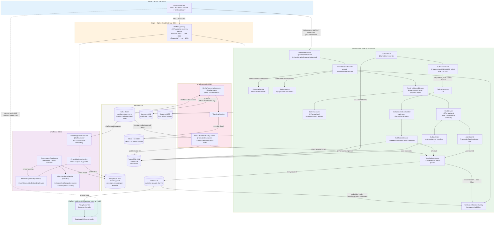

# ChatFlow — Interview Prep Guide

> Verified against actual source code. Every code snippet, class name, file path, and
> behaviour description is cross-checked against the implementation.
>
> Last verified: 2026-07-26

---

## Table of Contents

1. [System Design](#1-system-design)
   - [Architecture Diagram](#11-architecture-diagram)
   - [Module Responsibilities](#12-module-responsibilities)
   - [End-to-End: Sending a Message](#13-end-to-end-sending-a-message)
   - [Transactional Outbox Pattern](#14-transactional-outbox-pattern)
   - [Redis Pub/Sub — Cross-Server WS Fanout](#15-redis-pubsub--cross-server-ws-fanout)
   - [Kafka Event Bus](#16-kafka-event-bus)
   - [WebSocket Lifecycle](#17-websocket-lifecycle)
   - [RAG Pipeline](#18-rag-pipeline)
   - [JWT & Security](#19-jwt--security)
   - [Media Processing Pipeline](#110-media-processing-pipeline)
   - [Read & Delivery Receipts](#111-read--delivery-receipts)
   - [Presence System](#112-presence-system)
   - [Scalability & Trade-offs](#113-scalability--trade-offs)
2. [Java & Spring Boot Concepts](#2-java--spring-boot-concepts)
   - [OOP Pillars](#21-oop-pillars)
   - [Key Spring Annotations](#22-key-spring-annotations)
   - [Redis Pub/Sub — Code Deep Dive](#23-redis-pubsub--code-deep-dive)
   - [WebSocket — Code Deep Dive](#24-websocket--code-deep-dive)
   - [RAG — Code Deep Dive](#25-rag--code-deep-dive)
   - [Kafka — Code Deep Dive](#26-kafka--code-deep-dive)
   - [JWT & Security — Code Deep Dive](#27-jwt--security--code-deep-dive)
   - [Design Patterns](#28-design-patterns)
3. [Database Schema](#3-database-schema)
4. [Top 15 System Design Interview Questions](#4-top-15-system-design-interview-questions)

---

## 1. System Design

### 1.1 Architecture Diagram



---

### 1.2 Module Responsibilities

| Module | Port | Key classes | Purpose |
|---|---|---|---|
| `chatflow-contracts` | — | `MessageEmbeddingRequested`, `ConversationDeleted`, `MediaProcessingRequested`, `MediaThumbnailReady` | Shared Kafka event POJOs shared across services; no Spring dependency |
| `chatflow-storage` | — | `MediaStorageService` (interface), `LocalMediaStorageService`, `S3MediaStorageService` | Storage abstraction; reused by both core and chatflow-media |
| `chatflow-core` | 8080 | `ChatService`, `OutboxPoller`, `WebSocketGateway`, `CrossServerRelay`, `DeliveryService`, `PresenceService`, `ReplayService` | Auth, conversations, messages, friends, notifications, presence, WebSocket (embedded mode), outbox |
| `chatflow-ai` | 8081 | `ConversationRagService`, `EmbeddingEventConsumer`, `EmbeddingIngestService`, `AnthropicChatCompletionService` | Message embeddings via pgvector, semantic search, RAG Q&A using Claude |
| `chatflow-media` | 8082 | `MediaProcessingConsumer`, `ThumbnailService` | Kafka-driven thumbnail generation; results published back via Kafka |
| `chatflow-realtime` | 8083 | `RealtimeWebSocketHandler`, `RelaySubscriber` | Optional external WS edge; forwards commands to core `/internal/**` |
| `chatflow-gateway` | 8088 | `JwtValidator`, route config | Spring Cloud Gateway; JWT edge auth; single public entry point |

---

### 1.3 End-to-End: Sending a Message

This is the most important flow to understand deeply. Every design decision you made is visible here.

```
Client                      Core (ChatWebSocketHandler)
  │                               │
  │── WS frame: {                 │
  │     type: "SEND_MESSAGE",     │
  │     requestId: "req-1",       │
  │     payload: {                │
  │       conversationId: "...",  │
  │       clientMessageId: "...", │  ← client-generated UUID for idempotency
  │       content: "hello"        │
  │     }                         │
  │   } ─────────────────────────>│ handleTextMessage()
  │                               │   objectMapper.readValue() → InboundMessage
  │                               │   type == PING? → respond PONG, done
  │                               │   else → inboundService.dispatch()
  │                               │
  │                               │ RealtimeInboundService.dispatch()
  │                               │   parseAndValidate(payload, SendMessageRequest)
  │                               │   chatService.sendMessage(userId, convId, clientMsgId, content, "req-1")
  │                               │
  │                               │ ChatService.sendMessage() ── @Transactional ─── BEGIN TX
  │                               │   findByIdForUpdate(convId)     ← row lock prevents seq race
  │                               │   participantExists?             ← security check
  │                               │   findByConversationIdAndClientMessageId()
  │                               │     → if exists: send ACK and return (idempotency)
  │                               │   nextSequenceNumber(convId)     ← SELECT max(seq)+1
  │                               │   messageRepository.save(Message{seq, content, ...})
  │                               │   conversation.touchLastMessage(preview, now, seq)
  │                               │   participantRepo.advanceReadCursor(convId, senderId, seq)
  │                               │   outboxWriter.writeNotification(            ─┐
  │                               │     "message.created", convId, recipients)    │ same TX
  │                               │   outboxWriter.write(                         │
  │                               │     "message.embedding_requested", msgId, ...) ┘
  │                               │ ─────────────────────────────────────── COMMIT TX
  │                               │
  │                               │ AfterCommit.run() fires (post-commit only)
  │                               │   webSocketGateway.sendToUser(senderId, MESSAGE_ACK)
  │                               │   webSocketGateway.sendToUsers(recipients, MESSAGE)
  │                               │
  │                               │ WebSocketGateway.sendToUser(B, frame)
  │                               │   sessionRegistry.isConnected(B)? → local deliver
  │                               │   crossServerRelay.publish(B, frame)  ← always, for HA
  │                               │       redisTemplate.convertAndSend("chat:relay", json)
  │                               │
  │<── MESSAGE_ACK ───────────────│
  │
  (1 second later — OutboxPoller fires)
  │
  │                               │ OutboxPoller.poll()
  │                               │   findPendingIds(LIMIT 100) → [id1, id2, ...]
  │                               │   OutboxProcessor.process(id1)
  │                               │     @Transactional(REQUIRES_NEW)
  │                               │     repository.lockPending(id)  ← SELECT FOR UPDATE SKIP LOCKED
  │                               │     publisher.publish(event)
  │                               │       [in-process] → OutboxDispatcher.dispatch(event)
  │                               │         → NotificationOutboxHandler.supports("message.created")? YES
  │                               │         → notificationService.createAndPush(command)
  │                               │             persist Notification row
  │                               │             webSocketGateway.sendToUsers(recipients, NOTIFICATION)
  │                               │     event.markPublished()  ← status = PUBLISHED
  │                               │   OutboxProcessor.process(id2)  ← embedding req
  │                               │     → KafkaOutboxPublisher.publish()  [if transport=kafka]
  │                               │         kafkaTemplate.send("chatflow.outbox.events", msgId, json).get(10s)
```

**Key design decisions visible in this flow**:
- **`findByIdForUpdate`**: Takes a row lock on the conversation to prevent two concurrent sends from getting the same sequence number.
- **`clientMessageId` idempotency**: If the client resends (network retry), `findByConversationIdAndClientMessageId` returns the existing message instead of creating a duplicate.
- **`AfterCommit`**: WebSocket pushes happen AFTER the transaction commits. If the TX rolls back (e.g. conversation doesn't exist), no phantom message is delivered to recipients.
- **Outbox same-TX**: Writing the outbox row in the same TX as the message guarantees: if the message is persisted, the notification/embedding event will eventually be delivered. If the TX rolls back, both are rolled back.
- **Dual push strategy**: `WebSocketGateway` does local delivery AND publishes to Redis. This handles both: the recipient on this instance (fast local path) and recipients on other instances (Redis relay).

---

### 1.4 Transactional Outbox Pattern

**The Problem** — You need two things to happen together:
1. Persist a message in your database
2. Send an event to Kafka (or trigger a notification)

If you do them sequentially: what if Kafka is down after the DB commit? The message is saved but the event is never sent. What if the DB write happens inside a Kafka transaction? That requires XA/2PC — complex, slow, almost never used in practice.

**The Solution** — Write the event as a row in your own database, inside the same transaction as the business data. A poller reads and delivers it asynchronously.

```
One atomic DB transaction:
┌──────────────────────────────────────────────────────────────────────┐
│  INSERT INTO messages (id, conversation_id, content, seq_number, ...) │
│  UPDATE conversations SET last_message_seq = seq, ...                │
│  UPDATE conversation_participants SET last_read_seq = seq ...        │
│  INSERT INTO outbox_events (                                         │
│    id = UUID,                                                        │
│    aggregate_type = 'conversation',                                  │
│    aggregate_id   = conversationId,                                  │
│    event_type     = 'message.created',    ← OutboxEventType constant │
│    payload        = '{"recipientIds":[...], "preview":"...", ...}',  │
│    status         = 'PENDING'                                        │
│  )                                                                   │
│  INSERT INTO outbox_events (event_type='message.embedding_requested',│
│    payload = '{"messageId":"...","content":"...","senderName":"..."}')│
└──────────────────────────────────────────────────────────────────────┘
         ↓ COMMIT (both rows or neither)

OutboxPoller (@Scheduled every ${app.outbox.poll-interval-ms:1000}ms):
  SELECT id FROM outbox_events WHERE status = 'PENDING'
  ORDER BY created_at ASC LIMIT 100

  FOR EACH id → OutboxProcessor.process(id):
    @Transactional(REQUIRES_NEW)
    ├─ repository.lockPending(id)
    │    SELECT * FROM outbox_events WHERE id=? AND status='PENDING'
    │    FOR UPDATE SKIP LOCKED    ← concurrent pollers skip same row
    ├─ publisher.publish(event)    ← transport-pluggable
    │    [in-process] → OutboxDispatcher.dispatch()
    │    [kafka]      → kafkaTemplate.send(topic, aggId, json).get(10s)
    └─ event.markPublished()       ← status='PUBLISHED', publishedAt=now
```

**`OutboxEvent` entity** (`chatflow-core/.../infra/outbox/OutboxEvent.java`):

```java
@Entity @Table(name = "outbox_events",
    indexes = @Index(columnList = "status, created_at"))  // poller scans oldest PENDING first
public class OutboxEvent {
    @Id @GeneratedValue(strategy = GenerationType.UUID)
    private UUID id;

    @Column(name = "aggregate_type", length = 64)
    private String aggregateType;  // "conversation", "friendship", "message"

    private UUID aggregateId;      // the ID of the thing that changed

    @Column(name = "event_type", length = 64)
    private String eventType;      // OutboxEventType constants, e.g. "message.created"

    @Column(columnDefinition = "text")
    private String payload;        // JSON-serialized event body

    @Enumerated(EnumType.STRING)
    @Builder.Default
    private OutboxStatus status = OutboxStatus.PENDING;  // PENDING → PUBLISHED

    @PrePersist
    void prePersist() { if (createdAt == null) createdAt = Instant.now(); }

    public void markPublished() {
        this.status = OutboxStatus.PUBLISHED;
        this.publishedAt = Instant.now();
    }
}
```

**Event types** (`OutboxEventType.java` — string constants, not enum, so new types don't need a migration):

```java
public static final String MESSAGE_CREATED             = "message.created";
public static final String MESSAGE_EMBEDDING_REQUESTED = "message.embedding_requested";
public static final String MEDIA_PROCESSING_REQUESTED  = "media.processing_requested";
public static final String CONVERSATION_DELETED        = "conversation.deleted";
public static final String FRIEND_REQUESTED            = "friend.requested";
public static final String FRIEND_REQUEST_ACCEPTED     = "friend.request_accepted";
public static final String GROUP_MEMBER_ADDED          = "group.member_added";
// ...etc
```

**Transport plug** — the key design: by changing one environment variable, the same outbox row is dispatched in-JVM or over Kafka:

```java
// Default (no Kafka needed):
@ConditionalOnProperty(name="app.outbox.transport", havingValue="in-process", matchIfMissing=true)
public class InProcessOutboxPublisher implements OutboxEventPublisher {
    public void publish(OutboxEvent event) {
        dispatcher.dispatch(event);  // in-JVM call
    }
}

// Kafka transport:
@ConditionalOnProperty(name="app.outbox.transport", havingValue="kafka")
public class KafkaOutboxPublisher implements OutboxEventPublisher {
    public void publish(OutboxEvent event) {
        String json = objectMapper.writeValueAsString(OutboxEventMessage.from(event));
        // SYNCHRONOUS — broker failure keeps row PENDING, poller retries
        kafkaTemplate.send(topic, event.getAggregateId().toString(), json)
                      .get(sendTimeoutSeconds, TimeUnit.SECONDS);
    }
}
```

**Handler dispatch** (`OutboxDispatcher.java`):

```java
@Component
@RequiredArgsConstructor
public class OutboxDispatcher {
    private final List<OutboxEventHandler> handlers;  // Spring collects ALL beans

    public void dispatch(OutboxEvent event) {
        for (OutboxEventHandler handler : handlers) {
            if (handler.supports(event.getEventType())) {
                handler.handle(event);
                return;
            }
        }
        log.warn("No outbox handler for event type '{}'", event.getEventType());
    }
}

// NotificationOutboxHandler handles 7 event types:
@Component public class NotificationOutboxHandler implements OutboxEventHandler {
    private static final Set<String> TYPES = Set.of(
        "message.created", "friend.requested", "friend.request_accepted",
        "group.member_added", "group.member_removed", "group.role_changed",
        "group.ownership_transferred");

    public boolean supports(String type) { return TYPES.contains(type); }
    public void handle(OutboxEvent event) {
        notificationService.createAndPush(
            objectMapper.readValue(event.getPayload(), NotificationCommand.class));
    }
}
```

**At-least-once delivery guarantee**:
- Poller marks `PUBLISHED` only **after** successful publish
- If the process crashes between publish and marking: the row stays `PENDING` and is retried on next poll
- Handlers must be idempotent (or use the `processed_events` dedup table)

---

### 1.5 Redis Pub/Sub — Cross-Server WS Fanout

**Problem**: With N backend instances running, User A (on instance-1) sends a message to User B (connected to instance-2). Instance-1 has no WebSocket session for B.

**Solution**: Every instance publishes outbound messages to a Redis pub/sub channel. Every instance subscribes to the same channel and delivers to locally connected users.

```
Instance-1 (User A connected)          Instance-2 (User B connected)
   │                                        │
   WebSocketGateway.sendToUser(B, msg)      │
   │                                        │
   ├─ sessionRegistry.isConnected(B)?       │
   │   → false (B not on inst-1)            │
   │   → local delivery skipped            │
   │                                        │
   └─ crossServerRelay.publish(B, msg)      │
       ↓                                    │
       CrossServerMessage {                 │
         sourceInstanceId: "inst-1-uuid",  │
         targetUserId: B,                  │
         payload: msg                      │
       }                                   │
       redisTemplate.convertAndSend(       │
         "chat:relay", json)               │
              ↓                            │
           Redis pub/sub channel: chat:relay
              ↓                            ↓
         CrossServerRelay.onMessage()    CrossServerRelay.onMessage()
           sourceInstanceId == "inst-1"?  sourceInstanceId == "inst-1"?
           YES → same origin → SKIP       NO → different instance
                                          sessionRegistry.isConnected(B)?
                                          YES → sendToUser(B, msg)  ✓
```

**Self-delivery prevention**: `sourceInstanceId` is a UUID injected at startup via `@Value("${app.instance-id:${random.uuid}}")`. Each instance ignores its own published messages.

**Configuration** (`RedisConfig.java`):

```java
// Only subscribe in embedded mode — external mode has chatflow-realtime subscribing
@Bean
@ConditionalOnProperty(name = "app.realtime.mode", havingValue = "embedded", matchIfMissing = true)
public RedisMessageListenerContainer redisListenerContainer(
        RedisConnectionFactory factory, CrossServerRelay crossServerRelay) {
    RedisMessageListenerContainer container = new RedisMessageListenerContainer();
    container.setConnectionFactory(factory);
    container.addMessageListener(
        crossServerRelay,
        new ChannelTopic("chat:relay")  // CrossServerRelay.CHANNEL
    );
    return container;
}
```

**Why Redis pub/sub and not Kafka?**
- Pub/sub is fire-and-forget, no offset tracking — exactly what WS delivery needs (ephemeral)
- Lower latency than Kafka (no broker log write)
- If a subscriber misses a message (offline), it doesn't matter — reconnect catch-up (`ReplayService`) handles the gap
- Kafka would be overkill: you don't need message retention for real-time frames

---

### 1.6 Kafka Event Bus

**Topic layout**:

```
chatflow.outbox.events
  ├── Key: aggregateId (conversation UUID, message UUID, etc.)
  │         ↑ same aggregate → same partition → ordered delivery
  ├── Producers: KafkaOutboxPublisher (core)
  └── Consumer groups:
        chatflow-outbox      → OutboxConsumer (core) → OutboxDispatcher → notifications
        chatflow-ai-embedding → EmbeddingEventConsumer (ai-service) → pgvector
        chatflow-media       → MediaProcessingConsumer (media worker) → thumbnails

chatflow.media.thumbnail-ready
  ├── Key: mediaMessageId
  ├── Producer: MediaProcessingConsumer (media worker)
  └── Consumer group: chatflow-core-media → MediaThumbnailReadyListener (core)
```

**Why key = aggregateId?** Kafka guarantees ordering within a partition. If you send two events for conversation-ABC on partition 0, consumers see them in the order they were produced. This is critical: you don't want `GROUP_MEMBER_REMOVED` processed before `GROUP_MEMBER_ADDED`.

**Producer — synchronous send** (`KafkaOutboxPublisher`):

```java
kafkaTemplate.send(topic, aggregateId.toString(), json)
             .get(10, TimeUnit.SECONDS);  // BLOCKS — intentional
// If broker is down: ExecutionException thrown → OutboxProcessor's REQUIRES_NEW TX rolls back
// → outbox row stays PENDING → poller retries on next sweep
```

**Consumer groups — each independent**:

```java
// ai-service's consumer (group: chatflow-ai-embedding)
@KafkaListener(
    topics = "${app.outbox.topic:chatflow.outbox.events}",
    groupId = "${app.outbox.consumer-group:chatflow-ai-embedding}")
public void onOutboxEvent(String json) {
    OutboxEnvelope envelope = objectMapper.readValue(json, OutboxEnvelope.class);
    String type = envelope.eventType();

    if (MessageEmbeddingRequested.TYPE.equals(type)) {
        if (idempotencyGuard.alreadyProcessed(consumerGroup, envelope.id())) return;
        ingestService.ingest(objectMapper.readValue(envelope.payload(), MessageEmbeddingRequested.class));
        idempotencyGuard.markProcessed(consumerGroup, envelope.id());
    } else if (ConversationDeleted.TYPE.equals(type)) {
        // idempotent: delete by conversationId, no dedup needed
        ingestService.evictConversation(event.conversationId());
    }
    // other types: not ours, skip
}
```

**core's consumer** (group: `chatflow-outbox`) uses `firstTime()` — atomic INSERT:

```java
@KafkaListener(topics="chatflow.outbox.events", groupId="chatflow-outbox")
@Transactional
public void consume(String json) {
    OutboxEventMessage message = objectMapper.readValue(json, OutboxEventMessage.class);
    // firstTime = atomic INSERT INTO processed_events ON CONFLICT DO NOTHING
    // Returns true = first delivery (proceed), false = duplicate (skip)
    if (!idempotencyGuard.firstTime(consumerGroup, message.id())) return;
    dispatcher.dispatch(message.toOutboxEvent());  // notifications, WS pushes, etc.
}
```

**Two idempotency patterns**:
- `firstTime()` — atomic claim-then-work; handler not idempotent (NotificationService creates DB rows)
- `alreadyProcessed()` + `markProcessed()` — check-then-work-then-mark; handler is idempotent itself (embedding upsert on PK)

Both backed by the `processed_events` table:

```sql
-- V5 migration
CREATE TABLE processed_events (
    consumer_group varchar(100) NOT NULL,
    event_id       uuid         NOT NULL,
    processed_at   timestamp    NOT NULL,
    PRIMARY KEY (consumer_group, event_id)
);
-- INSERT ... ON CONFLICT DO NOTHING — the atomicity of firstTime()
```

---

### 1.7 WebSocket Lifecycle

**Authentication happens during the HTTP upgrade**, not per-frame:

```java
// WebSocketConfig.java (only created in embedded mode)
@Configuration @EnableWebSocket
@ConditionalOnProperty(name="app.realtime.mode", havingValue="embedded", matchIfMissing=true)
public class WebSocketConfig implements WebSocketConfigurer {
    @Override
    public void registerWebSocketHandlers(WebSocketHandlerRegistry registry) {
        registry.addHandler(chatWebSocketHandler, "/ws")
                .addInterceptors(jwtHandshakeInterceptor)  // ← auth here
                .setAllowedOriginPatterns("*");
    }
}
```

**`JwtHandshakeInterceptor`** reads the token from the **query param `?token=`** (NOT the Authorization header — browsers can't set headers on WS upgrades):

```java
@Override
public boolean beforeHandshake(ServerHttpRequest request, ..., Map<String, Object> attributes) {
    String token = UriComponentsBuilder
        .fromUri(request.getURI()).build()
        .getQueryParams().getFirst("token");  // ws://core:8080/ws?token=eyJ...

    UUID userId = token == null ? null : jwtService.extractUserId(token).orElse(null);
    if (userId == null) {
        return false;  // reject upgrade — HTTP 403
    }
    attributes.put("userId", userId);  // stored in WS session for the lifetime of the connection
    return true;
}
```

**`ChatWebSocketHandler`** lifecycle hooks:

```java
@Override
public void afterConnectionEstablished(WebSocketSession session) {
    UUID userId = extractUserId(session);  // reads session.attributes["userId"]
    if (userId == null) { closeQuietly(session, POLICY_VIOLATION); return; }

    boolean firstSession = sessionRegistry.register(userId, session);
    //  ↑ firstSession = true only when this is the FIRST tab for this user
    if (firstSession) presenceService.userConnected(userId);  // broadcast PRESENCE online
    replayService.replayForUser(userId);  // push messages beyond last_delivered_seq
}

@Override
public void afterConnectionClosed(WebSocketSession session, CloseStatus status) {
    UUID userId = extractUserId(session);
    boolean finalSession = sessionRegistry.remove(userId, session);
    //  ↑ finalSession = true only when this was the LAST tab
    if (finalSession) {
        presenceService.userDisconnected(userId);   // broadcast PRESENCE offline
        typingStateManager.clearAllForUser(userId); // stop any active typing indicators
    }
}
```

**`WebSocketSessionRegistry`** — multi-tab aware:

```java
private final Map<UUID, Set<WebSocketSession>> sessions = new ConcurrentHashMap<>();
private final Map<String, Instant> lastActivityAt = new ConcurrentHashMap<>();

public boolean register(UUID userId, WebSocketSession session) {
    Set<WebSocketSession> userSessions =
        sessions.computeIfAbsent(userId, ignored -> ConcurrentHashMap.newKeySet());
    userSessions.removeIf(s -> !s.isOpen());   // clean up stale sessions first
    boolean firstSession = userSessions.isEmpty(); // THEN check if first
    userSessions.add(session);
    lastActivityAt.put(session.getId(), Instant.now());
    return firstSession;
}

// Thread-safe write — sessions are NOT thread-safe for concurrent writes
private boolean send(WebSocketSession session, String json) {
    if (!session.isOpen()) return false;
    synchronized (session) {        // one writer at a time per session
        if (!session.isOpen()) return false;  // double-check after acquiring lock
        session.sendMessage(new TextMessage(json));
    }
    return true;
}
```

**Inbound dispatch** — `RealtimeInboundService.dispatch()` handles all command types:

```java
switch (type) {
    case SEND_MESSAGE   → chatService.sendMessage(...)
    case MESSAGE_DELIVERED → deliveryService.markDelivered(...)
    case CONVERSATION_OPEN → deliveryService.conversationOpen(...)
    case MARK_READ      → deliveryService.markRead(...)
    case TYPING         → typingStateManager.handleTyping(...)
    case PING           → throw (PING handled at ChatWebSocketHandler before reaching here)
}
```

**Reconnect catch-up** (`ReplayService`):

```java
@Transactional(readOnly = true)
public void replayForUser(UUID userId) {
    // Finds messages beyond the user's last_delivered_seq watermark
    List<MessageResponse> missed = messageRepository.findUndeliveredForUser(userId)
        .stream().map(MessageResponse::from).toList();
    missed.forEach(m -> webSocketGateway.sendToUser(userId,
        OutboundMessage.of(OutboundMessage.Type.MESSAGE, m)));
}
```

This means: even if a user was offline for 2 hours, on reconnect they get all missed messages pushed via WebSocket, before the UI makes any REST call.

---

### 1.8 RAG Pipeline

**RAG = Retrieval-Augmented Generation** — the pattern where you retrieve relevant context from your own data, inject it into the LLM prompt, and ask the LLM to answer based only on that context. ChatFlow uses it for "ask your chat history."

#### Ingestion path (async — happens for every message sent)

```
ChatService.sendMessage()
  → outboxWriter.write("message", msgId,
      "message.embedding_requested",
      new MessageEmbeddingRequested(
        msgId, convId, senderId, senderName, seq, content, "TEXT", createdAt))
  → COMMIT (outbox row PENDING)

OutboxPoller → KafkaOutboxPublisher
  → kafkaTemplate.send("chatflow.outbox.events", msgId, json)

EmbeddingEventConsumer (ai-service, group: chatflow-ai-embedding)
  → filter eventType == "message.embedding_requested"
  → idempotencyGuard.alreadyProcessed()? return
  → EmbeddingIngestService.ingest(event)
      if messageType != TEXT: return  ← media/system not embeddable
      if content blank: return
      EmbeddingResult result = embeddingService.embed(content)
        → OpenAiCompatibleEmbeddingService.embed(content)
          POST /embeddings {model: "nomic-embed-text", input: content}
          → response.data[0].embedding (List<Double>, 1536 dims)
          → float[] vector
      MessageEmbeddingRepository.upsert(MessageEmbeddingRow{
        messageId, conversationId, senderId, senderName,
        sequenceNumber, contentSnippet, vector, model, dims,
        messageCreatedAt, embeddedAt=now()
      })
      → INSERT INTO message_embeddings ON CONFLICT (message_id) DO UPDATE ...
  → idempotencyGuard.markProcessed()
```

#### Query path (user asks "what did we decide about the API design?")

```
POST /ai/conversations/{convId}/ask
  { "question": "what did we decide about the API design?" }

ConversationRagService.ask(callerId, conversationId, "what did we decide...")

1. Access control
   ConversationAccessClient.isParticipant(convId, callerId)
   → GET /internal/conversations/{convId}/participants/{callerId}
   → X-Internal-Token header
   → throws SecurityException if not participant

2. Embed the question
   EmbeddingResult q = embeddingService.embed("what did we decide about the API design?")
   → float[] qVector (1536 dims)

3. Vector search (pgvector)
   List<VectorSearchHit> hits = embeddingRepository
     .searchByVectorInConversation(convId, qVector, TOP_K=10)
   SQL:
     SELECT message_id, sender_id, sender_name, sequence_number,
            content_snippet,
            1 - (embedding <=> ?::vector) AS similarity
     FROM message_embeddings
     WHERE conversation_id = ?
     ORDER BY embedding <=> ?::vector   -- cosine distance, smallest first
     LIMIT 10

   HNSW index on (embedding vector_cosine_ops) makes this O(log N) approx

4. Build context
   "[msg-uuid-1] Alice: the REST API should be versioned under /api/v1\n"
   "[msg-uuid-2] Bob: agreed, and we should use JWT for auth\n"
   ... (up to 10 snippets)

5. Call LLM
   AnthropicChatCompletionService.complete(SYSTEM_PROMPT, context, question)

   MessageCreateParams.builder()
     .model("claude-sonnet-4-6")
     .maxTokens(8096)
     .thinking(ThinkingConfigAdaptive.builder().build())  // extended thinking enabled
     .systemOfTextBlockParams(List.of(
       TextBlockParam.builder().text(SYSTEM_INSTRUCTION).build(),
       TextBlockParam.builder().text(context)
         .cacheControl(CacheControlEphemeral.builder().build())  // ← CACHE BREAKPOINT
         .build()
     ))
     .addUserMessage("what did we decide about the API design?")
     .build()

   Prompt caching: system instruction + context are cached on first call.
   Follow-up questions on same transcript → cache hit → ~10% token cost.

6. Return AskResponse
   { answer: "Based on messages [uuid-1] and [uuid-2], you decided to...",
     citations: [{messageId, sequenceNumber, similarity: 0.89, preview: "the REST API..."}] }
```

**Why denormalized embeddings?** The `message_embeddings` table in `chatflow_ai` DB carries `senderName`, `contentSnippet`, `sequenceNumber` inline — copied from the `MessageEmbeddingRequested` event. This means the AI service can build RAG citations without any cross-service JOIN to core's `messages` or `users` tables. This is the **event-carried state transfer** pattern.

---

### 1.9 JWT & Security

**Token structure** (HMAC-SHA, `io.jsonwebtoken`):

```java
// JwtService.java — generation
public String generateToken(UUID userId) {
    return Jwts.builder()
        .subject(userId.toString())    // sub claim = userId
        .issuedAt(new Date())
        .expiration(new Date(System.currentTimeMillis() + expirationMs))  // default 24h
        .signWith(signingKey)          // Keys.hmacShaKeyFor(secret.getBytes(UTF_8))
        .compact();
}

// Validation
public Optional<UUID> extractUserId(String token) {
    try {
        Claims claims = Jwts.parser().verifyWith(signingKey).build()
            .parseSignedClaims(token).getPayload();
        return Optional.of(UUID.fromString(claims.getSubject()));
    } catch (Exception ex) {
        return Optional.empty();  // expired, tampered, wrong secret → empty
    }
}
```

**Security filter chain** (`SecurityConfig.java`):

```java
return http
    .csrf(AbstractHttpConfigurer::disable)         // stateless REST — no CSRF token needed
    .sessionManagement(s ->
        s.sessionCreationPolicy(SessionCreationPolicy.STATELESS))  // NO HttpSession created
    .authorizeHttpRequests(auth -> auth
        .requestMatchers("/api/auth/**").permitAll()   // login / register
        .requestMatchers("/ws").permitAll()             // WS auth done in JwtHandshakeInterceptor
        .requestMatchers("/media/**").permitAll()       // HMAC-signed URL gating (MediaTokenFilter)
        .requestMatchers("/internal/**").permitAll()    // X-Internal-Token gating in controllers
        .anyRequest().authenticated()
    )
    .addFilterBefore(jwtAuthenticationFilter, UsernamePasswordAuthenticationFilter.class)
    .build();
```

**JWT filter** (`JwtAuthenticationFilter.java`):

```java
@Override
protected void doFilterInternal(request, response, chain) {
    String header = request.getHeader("Authorization");
    if (header == null || !header.startsWith("Bearer ")) {
        chain.doFilter(request, response);  // no token → anonymous, security rejects later
        return;
    }
    String token = header.substring(7);  // strip "Bearer "
    Optional<UUID> userId = jwtService.extractUserId(token);
    if (userId.isPresent()) {
        UsernamePasswordAuthenticationToken auth =
            new UsernamePasswordAuthenticationToken(userId.get(), null, List.of());
        SecurityContextHolder.getContext().setAuthentication(auth);
    }
    chain.doFilter(request, response);
}
```

**WebSocket auth** — browsers can't set `Authorization` headers on WS upgrades, so the token is passed as a query param:

```javascript
// Frontend: WebSocketClient.ts
new WebSocket(`ws://localhost:8080/ws?token=${jwtToken}`)
```

```java
// Backend: JwtHandshakeInterceptor.java
String token = UriComponentsBuilder.fromUri(request.getURI())
    .build().getQueryParams().getFirst("token");  // ?token=eyJ...
```

**Internal service auth** — service-to-service calls (e.g. realtime → core, AI → core) use `X-Internal-Token`:

```java
// Each internal controller manually checks:
if (!internalToken.equals(request.getHeader("X-Internal-Token"))) {
    throw new SecurityException("Invalid internal token");
}
```

**`SecretsGuard`** — production fail-fast (`chatflow-core/.../config/SecretsGuard.java`):

```java
@Component @Profile("prod")   // ONLY active under the "prod" spring profile
public class SecretsGuard implements InitializingBean {
    @Value("${app.jwt.secret}")          private String jwtSecret;
    @Value("${app.internal.token:dev-internal-token}") private String internalToken;

    @Override
    public void afterPropertiesSet() {
        // Runs at startup AFTER all @Value fields are injected
        if ("change-me-in-production-must-be-at-least-32-chars".equals(jwtSecret)) {
            throw new IllegalStateException("Refusing to start: jwt.secret is still dev default");
        }
        if ("dev-internal-token".equals(internalToken)) {
            throw new IllegalStateException("Refusing to start: internal.token is still dev default");
        }
    }
}
```

**BCrypt** — password hashing:

```java
@Bean
public PasswordEncoder passwordEncoder() {
    return new BCryptPasswordEncoder(12);
    // Strength 12 = 2^12 = 4096 hash iterations
    // Adaptive: increase strength as hardware gets faster; hash stores the cost factor
}
```

---

### 1.10 Media Processing Pipeline

```
Upload (synchronous):
  POST /api/media/upload (multipart/form-data)
  ├─ storageService.store(file, storageKey)      → MinIO or local disk
  ├─ mediaMessageRepository.save(PENDING status)
  ├─ chatService.sendMediaMessage(...)           → INSERT messages + INSERT media_messages
  │     outboxWriter.write("media.processing_requested", mediaId, {storageKey, mimeType, ...})
  │         same TX as media_messages row
  └─ AfterCommit: webSocketGateway.sendToUsers(participants,
         MEDIA_MESSAGE frame with status=PENDING, no thumbnail yet)

Processing (async — chatflow-media worker):
  KafkaConsumer (group: chatflow-media) receives chatflow.outbox.events
  MediaProcessingConsumer.onOutboxEvent(json)
  ├─ filter: eventType == "media.processing_requested"
  ├─ ThumbnailService.generate(storageKey, messageType, mimeType)
  │    → fetch bytes from storage
  │    → resize image / extract video frame
  │    → store thumbnail → storageService.storeBytes(thumbnail, thumbnailKey)
  │    → return Optional<String> thumbnailUrl
  └─ produce: kafkaTemplate.send(
         "chatflow.media.thumbnail-ready",
         mediaMessageId, {mediaMessageId, thumbnailUrl})

Notification (core receives thumbnail-ready):
  MediaThumbnailReadyListener (@ConditionalOnProperty transport=kafka)
    @KafkaListener(topics="chatflow.media.thumbnail-ready", group="chatflow-core-media")
    @Transactional
    public void onThumbnailReady(String json) {
        media.setThumbnailUrl(event.thumbnailUrl());
        media.setStatus(MediaStatus.READY);
        mediaMessageRepository.save(media);
        AfterCommit.run(() -> webSocketGateway.sendToUsers(participants,
            MEDIA_THUMBNAIL_READY frame {mediaMessageId, thumbnailUrl}));
    }

Frontend reaction:
  dispatcher.ts handles MEDIA_THUMBNAIL_READY frame
  → messageStore.updateMessage(messageId, convId, { thumbnailUrl, mediaId })
  Patches the in-memory message — no REST fetch needed
```

---

### 1.11 Read & Delivery Receipts

**Design** — sequence watermarks on `conversation_participants` instead of per-message flags.

```sql
conversation_participants:
  last_read_seq      BIGINT  -- highest seq this user has explicitly read
  last_delivered_seq BIGINT  -- highest seq delivered to this user's device
```

**"Has user X read message N?"**:
```sql
SELECT last_read_seq >= :n
FROM conversation_participants
WHERE conversation_id = :convId AND user_id = :userId
```

**"How many unread for user X in conversation C?"**:
```sql
SELECT COUNT(*) FROM messages
WHERE conversation_id = :convId
  AND sequence_number > (
    SELECT last_read_seq FROM conversation_participants
    WHERE conversation_id = :convId AND user_id = :userId
  )
  AND deleted_at IS NULL
```

**WS events flow** (`DeliveryService.java`):

```java
// Client opens conversation tab:
case CONVERSATION_OPEN → deliveryService.conversationOpen(userId, convId)
  // advanceDeliveryCursor to max seq
  // AfterCommit: sendToOthers STATUS_UPDATE{lastDeliveredSeq}

// Client reads messages (scrolls to bottom):
case MARK_READ → deliveryService.markRead(userId, convId, upToSeq)
  // advanceReadCursor to upToSeq (only advances, never goes back)
  // AfterCommit: sendToOthers SEEN_UPDATE{lastReadSeq}
  // Frontend shows double tick ✓✓ when all participants' last_read_seq >= message.seq
```

**Advantage**: O(1) per-participant storage (1 row update) vs O(messages × participants) with per-message flags. Trade-off: no granularity below the watermark — if user reads msg 50 but not msg 45, cursor is 50 and 45 is considered read too. Acceptable for chat.

---

### 1.12 Presence System

**`PresenceStore`** interface with two implementations:

```java
// dev/test: @Profile("!prod") — in-memory, single instance only
@Component @Profile("!prod")
public class InMemoryPresenceStore implements PresenceStore {
    private final Map<UUID, Instant> onlineUsers = new ConcurrentHashMap<>();
    // setOnline(userId), setOffline(userId), isOnline(userId), getOnlineSince(userId)
}

// production: would be Redis-backed to work across multiple instances
// (not yet implemented in the codebase — a known scale gap)
```

**`PresenceService`** — broadcast to contacts when connecting/disconnecting:

```java
public void userConnected(UUID userId) {
    presenceStore.setOnline(userId);
    Instant since = presenceStore.getOnlineSince(userId).orElse(Instant.now());
    broadcastToContacts(userId, PresenceEvent.online(userId, since));
}

private void broadcastToContacts(UUID userId, PresenceEvent event) {
    // Finds all users sharing any conversation (DM or group) with this user
    List<UUID> contacts = participantRepository.findContactUserIds(userId);
    contacts.forEach(contactId ->
        webSocketGateway.sendToUser(contactId,
            OutboundMessage.of(OutboundMessage.Type.PRESENCE, event)));
}
```

**Scale gap**: `InMemoryPresenceStore` doesn't work with multiple instances (instance-1 sets User A online; instance-2 doesn't know). Production fix: Redis hash or sorted set keyed by userId.

---

### 1.13 Scalability & Trade-offs

| Concern | Decision | Trade-off |
|---|---|---|
| Multi-instance WebSocket delivery | Redis `chat:relay` pub/sub | Fire-and-forget; missed messages recovered by ReplayService on reconnect |
| Multi-instance outbox polling | `SELECT FOR UPDATE SKIP LOCKED` | Each instance claims different rows; no duplicate processing |
| Async side effects | Transactional outbox | ~1s latency on notifications/embeddings vs real-time; message delivery via WS is still immediate |
| Embedding pipeline | Separate `chatflow-ai` service | Slow embed calls never block the chat message path |
| Media processing | Kafka + `chatflow-media` service | Thumbnail generation never blocks the upload response |
| Idempotency | `clientMessageId` unique constraint + `processed_events` table | Duplicate handling at every at-least-once boundary |
| Presence (dev) | In-memory store | Doesn't work multi-instance; production needs Redis |
| LLM costs | Anthropic prompt caching (`CacheControlEphemeral`) | First question pays full price; follow-ups ~10× cheaper |
| Schema evolution | Flyway migrations + Hibernate `validate` | Boot fails fast on mismatch; zero silent schema drift |
| Secrets | `SecretsGuard` fail-fast on `@Profile("prod")` | Can't ship dev secrets to production |
| Storage | `MediaStorageService` interface | Swap local ↔ S3 by changing `SPRING_PROFILES_ACTIVE=s3` |

---

## 2. Java & Spring Boot Concepts

### 2.1 OOP Pillars

#### Encapsulation — hiding complexity behind a clean API

**`AfterCommit`** (`chatflow-core/.../infra/tx/AfterCommit.java`):

`TransactionSynchronizationManager` is the Spring API for hooking into the TX lifecycle. It's verbose and easy to get wrong. `AfterCommit` wraps it in one static method:

```java
public final class AfterCommit {
    private AfterCommit() {}  // not instantiable

    public static void run(Runnable action) {
        if (TransactionSynchronizationManager.isSynchronizationActive()) {
            // Inside a transaction — register to fire after commit
            TransactionSynchronizationManager.registerSynchronization(
                new TransactionSynchronization() {
                    @Override public void afterCommit() { action.run(); }
                });
        } else {
            // No transaction (e.g. unit test) — run immediately
            action.run();
        }
    }
}
```

Caller: `AfterCommit.run(() -> webSocketGateway.sendToUsers(recipients, message));`

Without this helper, every service method would have 10 lines of boilerplate instead of 1.

**`WebSocketSessionRegistry`**: Hides `ConcurrentHashMap<UUID, Set<WebSocketSession>>`, stale-session cleanup, `synchronized(session)` writes, and Micrometer metrics registration behind `register()`, `remove()`, `sendToUser()`, `isConnected()`.

**`OutboxWriter`**: Hides `objectMapper.writeValueAsString(payload)` + `repository.save(OutboxEvent.builder()...)` behind two methods: `write()` and `writeNotification()`.

---

#### Abstraction — depend on interfaces, not implementations

**`MediaStorageService`** (`chatflow-storage/.../media/storage/`):

```java
public interface MediaStorageService {
    StoredMedia store(MultipartFile file, String storageKey);
    StoredMedia storeBytes(byte[] data, String storageKey, String contentType);
    byte[]      read(String storageKey);
    void        delete(String storageKey);
    String      getUrl(String storageKey);
    String      presignedUrl(String storageKey, Duration ttl);
}
```

`@Profile("!s3")` → `LocalMediaStorageService` (writes to `./uploads/`, HMAC-signed URLs)
`@Profile("s3")` → `S3MediaStorageService` (AWS SDK v2, real presigned URLs from S3Presigner)

`MediaMessageService` injects `MediaStorageService` — it never mentions Local or S3. Set `SPRING_PROFILES_ACTIVE=s3` and the storage backend switches with **zero code changes**.

**`EmbeddingService`** (`chatflow-ai/.../embedding/EmbeddingService.java`):

```java
public interface EmbeddingService {
    EmbeddingResult embed(String text);
    // EmbeddingResult = record(float[] vector, String model, int dimensions)
}
```

`OpenAiCompatibleEmbeddingService` implements it with `RestClient` calling any OpenAI-compatible `/embeddings` endpoint (OpenAI, Ollama, Azure OpenAI). The provider is chosen purely by `app.ai.embedding.base-url`.

**`ChatCompletionService`** (`chatflow-ai/.../chat/ChatCompletionService.java`):

```java
public interface ChatCompletionService {
    String complete(String systemInstruction, String cacheableContext, String userQuestion);
}
```

`AnthropicChatCompletionService` implements it using the Anthropic Java SDK. The `cacheableContext` parameter maps to the prompt-cached block. Any future OpenAI/Gemini/local provider just needs a new bean implementing this interface.

**`OutboxEventHandler`** (`chatflow-core/.../infra/outbox/OutboxEventHandler.java`):

```java
public interface OutboxEventHandler {
    boolean supports(String eventType);
    void handle(OutboxEvent event);
}
```

Feature packages implement this (`NotificationOutboxHandler`, etc.) and register as beans. `OutboxDispatcher` depends only on the interface — `infra/outbox` has ZERO dependency on any feature package.

---

#### Polymorphism — same call, different behavior at runtime

**`OutboxDispatcher`**:

```java
private final List<OutboxEventHandler> handlers;  // Spring injects ALL beans in collection

public void dispatch(OutboxEvent event) {
    for (OutboxEventHandler handler : handlers) {
        if (handler.supports(event.getEventType())) {
            handler.handle(event);  // polymorphic — could be NotificationOutboxHandler or any future one
            return;
        }
    }
}
```

Adding a new event type means adding a new `@Component` that implements `OutboxEventHandler`. `OutboxDispatcher` is closed for modification, open for extension — **Open/Closed Principle**.

**Outbox transport**:

```java
// Both implement OutboxEventPublisher.publish(OutboxEvent)
InProcessOutboxPublisher  → dispatcher.dispatch(event)           // in-JVM
KafkaOutboxPublisher      → kafkaTemplate.send(topic, key, json) // over network

// OutboxProcessor never knows which one it got:
publisher.publish(event);  // polymorphic — Spring injects the active impl
```

---

#### Inheritance — extend and specialise

**`ChatWebSocketHandler extends TextWebSocketHandler`**:

Spring's `TextWebSocketHandler` defines the lifecycle contract. ChatFlow fills in the hooks:

```java
// Framework contract (abstract methods + lifecycle hooks):
public abstract class TextWebSocketHandler extends AbstractWebSocketHandler {
    public void afterConnectionEstablished(WebSocketSession session) throws Exception {}
    public void afterConnectionClosed(WebSocketSession s, CloseStatus status) throws Exception {}
    protected abstract void handleTextMessage(WebSocketSession s, TextMessage msg) throws Exception;
    public void handleTransportError(WebSocketSession s, Throwable ex) throws Exception {}
}

// ChatFlow implementation:
@Component
@ConditionalOnProperty(name="app.realtime.mode", havingValue="embedded", matchIfMissing=true)
public class ChatWebSocketHandler extends TextWebSocketHandler {
    @Override public void afterConnectionEstablished(session) { /* register, presence, replay */ }
    @Override public void afterConnectionClosed(session, status) { /* remove, presence, typing */ }
    @Override protected void handleTextMessage(session, message) { /* parse → dispatch → handle errors */ }
    @Override public void handleTransportError(session, ex) { /* log, close */ }
}
```

**`LocalMediaStorageService implements MediaStorageService`** + `@PostConstruct`:

```java
@PostConstruct
public void init() throws IOException {
    Files.createDirectories(Path.of(uploadDir));
}
// @PostConstruct fires AFTER @Value injection but BEFORE the bean is used
// Equivalent to implementing InitializingBean.afterPropertiesSet()
```

---

### 2.2 Key Spring Annotations

#### `@Transactional` — atomic database operations

```java
// ChatService.sendMessage — all-or-nothing:
@Transactional
public MessageResponse sendMessage(...) {
    // Row lock: prevents seq race between concurrent sends
    Conversation conv = conversationRepository.findByIdForUpdate(conversationId)
        .orElseThrow(() -> new IllegalArgumentException("not found"));

    // Security: throws SecurityException if not participant → TX rolls back
    if (!participantRepository.existsByConversationIdAndUserId(convId, senderId))
        throw new SecurityException("not a participant");

    // Idempotency: return existing if clientMessageId already used
    Optional<Message> existing = messageRepository
        .findByConversationIdAndClientMessageId(convId, clientMsgId);
    if (existing.isPresent()) { ... return early ... }

    // Everything below commits atomically or all rolls back:
    Message saved = messageRepository.save(new Message(...));
    conv.touchLastMessage(preview, now, seq);
    participantRepo.advanceReadCursor(convId, senderId, seq);
    outboxWriter.writeNotification(...);   // INSERT outbox_events
    outboxWriter.write(...);               // INSERT outbox_events
}
```

**Pitfall**: calling a `@Transactional` method on `this` (same class) bypasses the AOP proxy and runs WITHOUT a transaction. Always call via the injected bean.

**Propagation**: `OutboxProcessor` uses `@Transactional(propagation = REQUIRES_NEW)` — it suspends the caller's transaction and starts its own. This ensures one poisoned event doesn't roll back the entire poll batch.

---

#### `@Scheduled` — recurring background work

```java
@Scheduled(fixedDelayString = "${app.outbox.poll-interval-ms:1000}")
public void poll() {
    // fixedDelay = wait 1000ms AFTER the previous execution finishes
    // vs fixedRate = start every 1000ms regardless of execution time
    // fixedDelay is correct here: avoid overlapping polls if processing is slow
    List<UUID> ids = repository.findPendingIds(PageRequest.of(0, BATCH_SIZE));
    if (ids.isEmpty()) return;
    for (UUID id : ids) {
        try {
            processor.process(id);
        } catch (Exception e) {
            log.error("Outbox dispatch failed for event {}; will retry", id, e);
            // event stays PENDING — retried next poll
        }
    }
}
```

Requires `@EnableScheduling` on a `@Configuration` class (Spring Boot auto-configuration provides this).

---

#### `@KafkaListener` — subscribing to Kafka topics

```java
// AI service:
@KafkaListener(
    topics   = "${app.outbox.topic:chatflow.outbox.events}",
    groupId  = "${app.outbox.consumer-group:chatflow-ai-embedding}")
public void onOutboxEvent(String json) {
    // Spring Kafka:
    // 1. Deserializes the raw byte[] to String (StringDeserializer)
    // 2. Calls this method on a thread from the KafkaListenerContainerFactory's executor
    // 3. Commits the offset after the method returns normally
    // 4. Does NOT commit if an exception is thrown (will redeliver)
}
```

**Consumer groups**: each group maintains its own committed offsets. Adding a new consumer group means that group starts reading from the beginning (earliest) of each partition. Core's `chatflow-outbox` and AI's `chatflow-ai-embedding` both receive every event on `chatflow.outbox.events` — independently, at their own pace.

---

#### `@ConditionalOnProperty` — feature flags at the Spring container level

```java
// Strategy pattern + conditional bean: only ONE publisher exists at runtime
@Component
@ConditionalOnProperty(name="app.outbox.transport", havingValue="in-process", matchIfMissing=true)
class InProcessOutboxPublisher implements OutboxEventPublisher { ... }

@Component
@ConditionalOnProperty(name="app.outbox.transport", havingValue="kafka")
class KafkaOutboxPublisher implements OutboxEventPublisher { ... }

// Similarly:
@ConditionalOnProperty(name="app.realtime.mode", havingValue="embedded", matchIfMissing=true)
class ChatWebSocketHandler extends TextWebSocketHandler { ... }

@ConditionalOnProperty(name="app.realtime.mode", havingValue="embedded", matchIfMissing=true)
RedisMessageListenerContainer redisListenerContainer(...) { ... }  // @Bean in RedisConfig

@ConditionalOnProperty(name="app.ai.chat.provider", havingValue="anthropic", matchIfMissing=true)
class AnthropicChatCompletionService implements ChatCompletionService { ... }
```

`matchIfMissing = true` means the condition is satisfied when the property is absent — so the default behavior (in-process, embedded, anthropic) works without any configuration.

---

#### `@Profile` — environment-based bean activation

```java
@Component @Profile("!s3")  // active when "s3" profile NOT active
class LocalMediaStorageService implements MediaStorageService { ... }

@Component @Profile("s3")   // active when "s3" profile IS active
class S3MediaStorageService implements MediaStorageService { ... }

@Component @Profile("!prod")  // active in dev + test (not production)
class InMemoryPresenceStore implements PresenceStore { ... }

@Component @Profile("prod")   // active ONLY in production
class SecretsGuard implements InitializingBean { ... }
```

`SPRING_PROFILES_ACTIVE=s3,prod` activates S3 storage AND the production secrets guard simultaneously.

---

#### `@Value` — inject a single property

```java
// Fallback syntax: use random UUID if not configured (so each instance gets a unique ID)
@Value("${app.instance-id:${random.uuid}}")
String instanceId;  // used in CrossServerRelay for self-delivery prevention

// Kafka topic name — override in different environments
@Value("${app.outbox.kafka.topic:chatflow.outbox.events}")
String topic;

// Poll interval — tunable without code changes
@Scheduled(fixedDelayString = "${app.outbox.poll-interval-ms:1000}")
```

---

#### `@ConfigurationProperties` — typed config binding

```java
@ConfigurationProperties(prefix = "app.ai.embedding")
@Component
public class EmbeddingProperties {
    private String baseUrl;    // app.ai.embedding.base-url
    private String model;      // app.ai.embedding.model
    private String apiKey;     // app.ai.embedding.api-key
    private int    dimensions; // app.ai.embedding.dimensions
    // getters via @Data or explicit
}
```

vs `@Value`: `@ConfigurationProperties` is better for related config groups — IDE autocomplete, validation, single class, no string typos.

---

#### `@PostConstruct` vs `InitializingBean`

```java
// @PostConstruct — annotation-based, runs after all @Value fields are injected
@PostConstruct
public void init() throws IOException {
    Files.createDirectories(Path.of(uploadDir));  // LocalMediaStorageService
}

// InitializingBean — interface-based, same timing as @PostConstruct
public class SecretsGuard implements InitializingBean {
    @Override
    public void afterPropertiesSet() {  // called by Spring after all properties set
        if (defaultSecret.equals(jwtSecret)) {
            throw new IllegalStateException("Refusing to start: dev secret in prod");
        }
    }
}
```

Both fire at the same point in the bean lifecycle. `@PostConstruct` is the modern approach.

---

#### Lombok annotations used across the codebase

```java
@Service
@RequiredArgsConstructor     // generates: public ChatService(ConversationRepository cr, ...) { ... }
public class ChatService {
    private final ConversationRepository conversationRepository;  // final → injected via constructor
    private final MessageRepository messageRepository;
    private final WebSocketGateway webSocketGateway;
    private final OutboxWriter outboxWriter;
    // Spring sees one constructor → uses it for injection — no @Autowired needed
}

@Slf4j  // generates: private static final Logger log = LoggerFactory.getLogger(ChatService.class)

@Builder  // enables: Message.builder().conversationId(id).content("hi").sequenceNumber(5).build()
@Entity
public class Message { ... }

@Getter @Setter  // generates getters and setters for all fields
@Data             // shorthand for @Getter + @Setter + @EqualsAndHashCode + @ToString
```

---

### 2.3 Redis Pub/Sub — Code Deep Dive

**Full wiring**:

```java
// Step 1 — RedisConfig.java: wire the listener container
@Bean
@ConditionalOnProperty(name="app.realtime.mode", havingValue="embedded", matchIfMissing=true)
public RedisMessageListenerContainer redisListenerContainer(
        RedisConnectionFactory factory,
        CrossServerRelay crossServerRelay) {       // CrossServerRelay IS the listener

    RedisMessageListenerContainer container = new RedisMessageListenerContainer();
    container.setConnectionFactory(factory);
    container.addMessageListener(
        crossServerRelay,                          // implements MessageListener
        new ChannelTopic(CrossServerRelay.CHANNEL) // "chat:relay"
    );
    return container;
}
```

**Step 2 — publish** (`CrossServerRelay.publish`):

```java
public void publish(UUID targetUserId, OutboundMessage message) {
    try {
        CrossServerMessage envelope =
            new CrossServerMessage(instanceId, targetUserId, message);
        redisTemplate.convertAndSend(
            CHANNEL,                                        // "chat:relay"
            objectMapper.writeValueAsString(envelope)       // JSON string
        );
    } catch (Exception ex) {
        log.warn("Failed to publish relay message to userId={}", targetUserId);
        // Failure is silent — WS delivery is best-effort; ReplayService handles gaps
    }
}
```

**Step 3 — consume** (`CrossServerRelay.onMessage`):

```java
@Override   // implements MessageListener
public void onMessage(Message message, byte[] pattern) {
    try {
        CrossServerMessage envelope =
            objectMapper.readValue(message.getBody(), CrossServerMessage.class);

        // Prevent self-delivery: every instance publishes AND subscribes
        if (instanceId.equals(envelope.getSourceInstanceId())) {
            return;  // this message came from ME — skip
        }

        if (sessionRegistry.isConnected(envelope.getTargetUserId())) {
            sessionRegistry.sendToUser(
                envelope.getTargetUserId(),
                envelope.getPayload()
            );
        }
        // If user not connected here either: message lost (WS is ephemeral)
        // ReplayService fills the gap on next connect
    } catch (Exception ex) {
        log.warn("Failed to process relay message: {}", ex.getMessage());
    }
}
```

**`CrossServerMessage`** record:

```java
record CrossServerMessage(
    String sourceInstanceId,  // UUID of the publishing instance
    UUID targetUserId,
    OutboundMessage payload
) {}
```

**Interview point about Redis pub/sub vs Kafka**:
- Pub/sub: no persistence, no offsets, no consumer groups, fire-and-forget, ultra-low latency
- Kafka: persisted log, offsets, consumer groups, replay, ordered, higher latency
- For WS delivery, pub/sub is correct — sessions are ephemeral. If the subscriber is offline, the user reconnects and `ReplayService` fills the gap.

---

### 2.4 WebSocket — Code Deep Dive

**Why query param `?token=` and not Authorization header?**

The WebSocket protocol spec (RFC 6455) allows only HTTP headers present in the initial HTTP upgrade. Browsers do NOT allow JavaScript to set `Authorization` headers on `new WebSocket(url)` calls. The only way to pass credentials in a browser WS connection is via query params or cookies. Query param is simpler and stateless.

**Full flow from connection to message**:

```java
// 1. Client connects: ws://localhost:8080/ws?token=eyJ...
// JwtHandshakeInterceptor runs BEFORE the WS connection is established:
boolean beforeHandshake(...) {
    String token = UriComponentsBuilder.fromUri(request.getURI())
        .build().getQueryParams().getFirst("token");
    Optional<UUID> userId = jwtService.extractUserId(token);
    if (userId.isEmpty()) return false;  // reject → HTTP 403
    attributes.put("userId", userId.get());
    return true;
}

// 2. Connection established:
void afterConnectionEstablished(WebSocketSession session) {
    UUID userId = (UUID) session.getAttributes().get("userId");
    // register() first removes dead sessions, then checks if it's the FIRST live session
    boolean first = sessionRegistry.register(userId, session);
    if (first) presenceService.userConnected(userId);  // → PRESENCE:online to all contacts
    replayService.replayForUser(userId);  // push undelivered messages
}

// 3. Inbound message:
protected void handleTextMessage(WebSocketSession session, TextMessage msg) {
    UUID userId = (UUID) session.getAttributes().get("userId");
    InboundMessage inbound = objectMapper.readValue(msg.getPayload(), InboundMessage.class);

    if (inbound.getType() == PING) {
        sendDirect(session, OutboundMessage.responseTo(PONG, inbound.getRequestId(), Map.of()));
        return;
    }
    // All other types go to RealtimeInboundService (SEND_MESSAGE, MARK_READ, TYPING, etc.)
    inboundService.dispatch(userId, inbound.getType(), inbound.getPayload(), inbound.getRequestId());
}

// 4. Thread-safe outbound send:
private boolean send(WebSocketSession session, String json) {
    if (!session.isOpen()) return false;
    synchronized (session) {    // WebSocketSession is NOT thread-safe for writes
        if (!session.isOpen()) return false;   // double-checked locking
        session.sendMessage(new TextMessage(json));
    }
    return true;  // false means session was closed; registry removes it
}

// 5. Connection closed:
void afterConnectionClosed(WebSocketSession session, CloseStatus status) {
    UUID userId = (UUID) session.getAttributes().get("userId");
    boolean last = sessionRegistry.remove(userId, session);
    if (last) {
        presenceService.userDisconnected(userId);   // PRESENCE:offline to contacts
        typingStateManager.clearAllForUser(userId); // cancel all typing indicators
    }
}
```

---

### 2.5 RAG — Code Deep Dive

**Why use an interface for `EmbeddingService`?**

```java
// interface in chatflow-ai:
public interface EmbeddingService {
    EmbeddingResult embed(String text);
}

// implementation: OpenAI-compatible (works with OpenAI, Ollama, Azure OpenAI):
@Service
public class OpenAiCompatibleEmbeddingService implements EmbeddingService {
    private final EmbeddingProperties props;
    private final RestClient restClient;

    public OpenAiCompatibleEmbeddingService(EmbeddingProperties props) {
        this.props = props;
        RestClient.Builder builder = RestClient.builder().baseUrl(props.getBaseUrl());
        if (props.getApiKey() != null && !props.getApiKey().isBlank())
            builder.defaultHeader("Authorization", "Bearer " + props.getApiKey());
        this.restClient = builder.build();
    }

    @Override
    public EmbeddingResult embed(String text) {
        EmbeddingResponse response = restClient.post()
            .uri("/embeddings")
            .contentType(MediaType.APPLICATION_JSON)
            .body(new EmbeddingRequest(props.getModel(), text))  // {model, input}
            .retrieve()
            .body(EmbeddingResponse.class);

        List<Double> raw = response.data().get(0).embedding();
        float[] vector = new float[raw.size()];
        for (int i = 0; i < raw.size(); i++) vector[i] = raw.get(i).floatValue();
        return new EmbeddingResult(vector, props.getModel(), vector.length);
    }

    private record EmbeddingRequest(String model, String input) {}
    private record EmbeddingResponse(List<Data> data) {
        private record Data(List<Double> embedding) {}
    }
}
```

**pgvector — what `<=>` means**:
- `<=>` = cosine **distance** operator (0 = identical vectors, 2 = opposite)
- `1 - (embedding <=> ?::vector)` = cosine **similarity** (1 = identical, 0 = orthogonal)
- HNSW index = Hierarchical Navigable Small World — approximate nearest neighbours in O(log N)
- Alternative to brute-force O(N) exact search — faster but not 100% exact

**Prompt caching** (`AnthropicChatCompletionService`):

```java
MessageCreateParams params = MessageCreateParams.builder()
    .model("claude-sonnet-4-6")
    .maxTokens(8096)
    .thinking(ThinkingConfigAdaptive.builder().build())   // extended thinking
    .systemOfTextBlockParams(List.of(
        // Block 1: frozen system instruction — cheap, always cached after first request
        TextBlockParam.builder()
            .text(SYSTEM_INSTRUCTION)
            .build(),
        // Block 2: large reusable context (conversation transcript) — marked for caching
        TextBlockParam.builder()
            .text(cacheableContext)
            .cacheControl(CacheControlEphemeral.builder().build())  // ← cache breakpoint
            .build()
    ))
    .addUserMessage(userQuestion)   // volatile — NOT cached, changes every request
    .build();
```

- **First request**: Anthropic processes system instruction + context = full token cost
- **Subsequent requests on same context**: cache hit on context block = ~10% cost (input tokens)
- Cache TTL = 5 minutes (ephemeral)
- Good for: many questions over the same conversation transcript in a short window

---

### 2.6 Kafka — Code Deep Dive

**`KafkaOutboxPublisher`** — why synchronous?

```java
@Override
public void publish(OutboxEvent event) {
    String json = objectMapper.writeValueAsString(OutboxEventMessage.from(event));
    String key = event.getAggregateId() != null ? event.getAggregateId().toString() : null;
    try {
        kafkaTemplate.send(topic, key, json)
            .get(sendTimeoutSeconds, TimeUnit.SECONDS);  // BLOCKS up to 10s
    } catch (InterruptedException e) {
        Thread.currentThread().interrupt();
        throw new IllegalStateException("Interrupted publishing outbox event...", e);
    } catch (Exception e) {
        // This exception propagates out of OutboxProcessor.process() →
        // OutboxProcessor's REQUIRES_NEW TX rolls back →
        // outbox row stays PENDING (status not updated to PUBLISHED) →
        // OutboxPoller retries it next sweep
        throw new IllegalStateException("Failed to publish outbox event to Kafka", e);
    }
}
```

If we made it async (`kafkaTemplate.send()` without `.get()`), the REQUIRES_NEW transaction would commit before we know if Kafka succeeded. We'd mark the row PUBLISHED even though the broker never received it — lost event.

**Two idempotency patterns side by side**:

```java
// Pattern A: firstTime() — atomic claim + work in one TX
// Use when: handler is NOT idempotent (creates DB rows)
@Transactional
public void consume(String json) {
    OutboxEventMessage message = objectMapper.readValue(json, OutboxEventMessage.class);
    if (!idempotencyGuard.firstTime(consumerGroup, message.id())) return;
    // firstTime() = INSERT INTO processed_events ON CONFLICT DO NOTHING
    // Returns 1 row inserted = true (first) or 0 = false (duplicate)
    // TX: claim row + handler side effects commit together → crash between them = reprocess cleanly
    dispatcher.dispatch(message.toOutboxEvent());
}

// Pattern B: alreadyProcessed() + markProcessed() — check-work-mark
// Use when: handler IS idempotent (upsert, overwrite)
public void onOutboxEvent(String json) {
    if (idempotencyGuard.alreadyProcessed(consumerGroup, envelope.id())) return;
    ingestService.ingest(event);          // embedding upsert — idempotent on message_id PK
    idempotencyGuard.markProcessed(consumerGroup, envelope.id());
    // Crash between ingest and markProcessed → redelivered → ingest runs again (idempotent ✓)
    // No TX needed because ingest is safe to re-run
}
```

---

### 2.7 JWT & Security — Code Deep Dive

**Filter execution order** (Spring Security):

```
HTTP Request
  ↓
CorsFilter
  ↓
SecurityContextPersistenceFilter
  ↓
JwtAuthenticationFilter  ← our custom filter (addFilterBefore UsernamePasswordAuthenticationFilter)
  │  reads Authorization: Bearer <token>
  │  validates JWT → extracts userId
  │  sets SecurityContext.authentication = UsernamePasswordAuthenticationToken(userId)
  ↓
UsernamePasswordAuthenticationFilter
  ↓
ExceptionTranslationFilter
  ↓
FilterSecurityInterceptor
  │  checks .authorizeHttpRequests rules
  │  if .anyRequest().authenticated() and no authentication → 401
  ↓
Your Controller
```

**Stateless sessions**:

```java
.sessionManagement(s -> s.sessionCreationPolicy(SessionCreationPolicy.STATELESS))
```

With STATELESS, Spring Security never creates an `HttpSession`. Every request must carry the JWT — no session cookies. This means:
- Horizontal scaling: any instance can handle any request
- No session affinity required
- Logout = throw away the token client-side (server-side token revocation needs a blocklist)

**BCrypt strength**:

```java
new BCryptPasswordEncoder(12)
// 12 rounds → 2^12 = 4096 hash iterations
// ~150ms to hash on modern hardware (intentionally slow — makes brute force impractical)
// The hash itself encodes the cost factor: "$2a$12$..." — so old hashes still verify
//   even after you upgrade to strength=13
```

---

### 2.8 Design Patterns

#### Strategy Pattern

Define a family of algorithms behind an interface; swap implementations without changing callers.

| Interface | Impl A | Impl B | Switch |
|---|---|---|---|
| `OutboxEventPublisher` | `InProcessOutboxPublisher` | `KafkaOutboxPublisher` | `@ConditionalOnProperty(transport)` |
| `MediaStorageService` | `LocalMediaStorageService` | `S3MediaStorageService` | `@Profile(!s3)` / `@Profile(s3)` |
| `ChatCompletionService` | `AnthropicChatCompletionService` | (future provider) | `@ConditionalOnProperty(provider)` |
| `EmbeddingService` | `OpenAiCompatibleEmbeddingService` | (any future) | URL configuration |
| `PresenceStore` | `InMemoryPresenceStore` | (future Redis impl) | `@Profile(!prod)` |

All callers (`OutboxProcessor`, `MediaMessageService`, `ConversationRagService`, `PresenceService`) inject the interface and never mention the concrete class.

---

#### Observer / Dispatcher Pattern

`OutboxDispatcher` collects all `OutboxEventHandler` beans and routes each event to the right handler:

```java
// Adding a new event type = add a new @Component:
@Component
public class MyNewOutboxHandler implements OutboxEventHandler {
    public boolean supports(String type) { return "my.new_event".equals(type); }
    public void handle(OutboxEvent event) { /* new behavior */ }
}
// OutboxDispatcher picks it up automatically — ZERO changes to dispatcher
```

This is the **plugin / registry** pattern: handlers register themselves by implementing the interface. The dispatcher is closed for modification, open for extension.

---

#### Template Method

`TextWebSocketHandler` defines the algorithm structure (lifecycle steps); subclass fills in the steps:

```
TextWebSocketHandler (framework skeleton):
  handleMessage() → calls handleTextMessage() ← abstract, must override
               → calls handleBinaryMessage()  ← can override
               → calls handleTransportError() ← can override
  + afterConnectionEstablished()              ← can override
  + afterConnectionClosed()                   ← can override

ChatWebSocketHandler (our behavior):
  fills in all 4 hooks with ChatFlow-specific logic
```

---

#### Builder Pattern

Every entity uses Lombok `@Builder`:

```java
Message saved = messageRepository.save(Message.builder()
    .conversationId(conversationId)
    .senderId(senderId)
    .clientMessageId(clientMessageId)
    .type(MessageType.TEXT)
    .content(content)
    .sequenceNumber(seq)
    .build());
// vs: new Message(conversationId, senderId, clientMessageId, TEXT, content, seq, null, null...)
// Builder is readable, explicit, and safe against positional argument mistakes
```

Anthropic SDK uses the same pattern:

```java
MessageCreateParams params = MessageCreateParams.builder()
    .model("claude-sonnet-4-6").maxTokens(8096)
    .thinking(ThinkingConfigAdaptive.builder().build())
    .addUserMessage(question)
    .build();
```

---

#### Fail-Fast / Guard Pattern

Validate preconditions at the **earliest possible point**:

```java
// SecretsGuard: fail at startup, not at first API call
@Component @Profile("prod")
public class SecretsGuard implements InitializingBean {
    public void afterPropertiesSet() {
        if (devDefaultJwtSecret.equals(jwtSecret)) throw new IllegalStateException("...");
    }
}

// Path traversal guard: reject bad input immediately
private Path resolve(String storageKey) {
    Path root = Path.of(uploadDir).toAbsolutePath().normalize();
    Path target = root.resolve(storageKey).normalize();
    if (!target.startsWith(root)) {
        throw new StorageException("Illegal storage key — path traversal detected");
    }
    return target;
    // Prevents: storageKey = "../../etc/passwd" from escaping the upload directory
}

// Idempotency guard: fail fast before expensive work
if (!participantRepository.existsByConversationIdAndUserId(convId, senderId))
    throw new SecurityException("not a participant");
```

---

## 3. Database Schema

### Core tables (PostgreSQL `:5432`, db: `chatflow`)

```sql
-- users
id (UUID PK), username (UNIQUE), password (BCrypt), created_at

-- conversations
id (UUID PK),
type (DIRECT | GROUP),
name (null for DM),
created_by (null for DM),
dm_key VARCHAR UNIQUE,          -- deterministic key for DM: sorted(userA, userB) → prevents duplicate DMs
last_message_preview VARCHAR(255),
last_message_at TIMESTAMPTZ,
last_message_seq BIGINT,
created_at, updated_at, deleted_at (soft-delete for groups)

-- conversation_participants  (membership + read/delivery watermarks)
id (UUID PK),
conversation_id,
user_id,
role (MEMBER | ADMIN | OWNER),
last_read_seq      BIGINT DEFAULT 0,  -- ← read receipt cursor
last_delivered_seq BIGINT DEFAULT 0,  -- ← delivery cursor
muted BOOLEAN,
joined_at TIMESTAMPTZ
UNIQUE(conversation_id, user_id)

-- messages
id (UUID PK),
conversation_id,
sender_id,
client_message_id VARCHAR(100),        -- idempotency key from client
type (TEXT | MEDIA | SYSTEM),
content VARCHAR(4000),
sequence_number BIGINT,               -- monotonically increasing per conversation
created_at TIMESTAMPTZ,
edited_at, deleted_at (soft-delete)
UNIQUE(conversation_id, sequence_number)
UNIQUE(conversation_id, client_message_id)
INDEX(conversation_id, sequence_number)  -- fast range queries

-- media_messages  (detail row for type=MEDIA messages)
id (UUID PK), message_id, sender_id,
message_type (IMAGE | VIDEO | AUDIO | FILE),
status (PENDING | READY | FAILED),
media_url, thumbnail_url, mime_type, file_size,
storage_key, original_file_name, caption,
deleted, created_at, updated_at

-- outbox_events  (transactional outbox)
id (UUID PK),
aggregate_type VARCHAR(64),   -- "conversation", "message", "friendship"
aggregate_id UUID,            -- the thing that changed
event_type VARCHAR(64),       -- OutboxEventType constants
payload TEXT,                 -- JSON body
status VARCHAR(16) DEFAULT 'PENDING',  -- PENDING → PUBLISHED (OutboxStatus enum)
created_at TIMESTAMPTZ,
published_at TIMESTAMPTZ
INDEX(status, created_at)     -- poller scans PENDING oldest-first

-- notifications
id (UUID PK), recipient_id, actor_id,
type VARCHAR (NEW_MESSAGE | FRIEND_REQUEST | GROUP_INVITE | ...),
reference_type, reference_id,
preview VARCHAR(280),
event_count INT DEFAULT 1,   -- coalesced: "3 new messages in conversation X"
read BOOLEAN DEFAULT false,
created_at, read_at, deleted_at

-- friendships
id (UUID PK), user_one_id, user_two_id, initiator_id,
status (PENDING | ACCEPTED | DECLINED | BLOCKED),
created_at, updated_at
UNIQUE(user_one_id, user_two_id)  -- prevents duplicate friendship pairs

-- processed_events  (Kafka consumer idempotency)
consumer_group VARCHAR(100),
event_id UUID,
processed_at TIMESTAMPTZ
PRIMARY KEY(consumer_group, event_id)
-- INSERT ... ON CONFLICT DO NOTHING enables atomic firstTime() claim
```

### AI tables (PostgreSQL `:5433`, db: `chatflow_ai`)

```sql
-- message_embeddings (pgvector)
message_id UUID PRIMARY KEY,           -- no FK to core (cross-DB would need distributed TX)
conversation_id UUID NOT NULL,
sender_id UUID,
sender_name VARCHAR(255),
sequence_number BIGINT NOT NULL,
content_snippet TEXT NOT NULL,         -- up to 4000 chars (full message content)
embedding vector(1536) NOT NULL,       -- OpenAI text-embedding-3-small = 1536 dims
model VARCHAR(100) NOT NULL,           -- "nomic-embed-text", "text-embedding-3-small", etc.
dimensions INT NOT NULL,
message_created_at TIMESTAMPTZ,
embedded_at TIMESTAMPTZ

-- ANN search index (cosine similarity):
CREATE INDEX idx_message_embedding_hnsw
    ON message_embeddings
    USING hnsw (embedding vector_cosine_ops);
-- m=16, ef_construction=64 (HNSW default params)
-- ef_search at query time balances recall vs latency

CREATE INDEX idx_message_embedding_conversation ON message_embeddings (conversation_id);
-- Filters by conversation BEFORE the vector ordering for scoped search
```

### Flyway migration history

| Version | File | Description |
|---|---|---|
| V1 | `V1__init.sql` | Full core baseline — all tables above |
| V2 | `V2__soft_delete_columns.sql` | `deleted_at` on conversations + messages |
| V3 | `V3__ai_embeddings.sql` | `message_embeddings` in core DB (later removed) |
| V4 | `V4__drop_message_embeddings.sql` | Remove from core, move to ai-service's own DB |
| V5 | `V5__processed_events.sql` | Kafka consumer idempotency table |

Hibernate in **`validate` mode**: reads the actual schema and validates entity mappings at startup. If a column is missing or wrong type, the app fails immediately instead of at the first runtime query.

---

## 4. Top 15 System Design Interview Questions

---

### Q1: Design a real-time chat system that scales to millions of users

**Answer framework: Clients → Gateway → Application → Storage → Messaging**

**WebSocket for real-time delivery**:
- WebSocket (RFC 6455) is a full-duplex protocol over a single TCP connection. After the HTTP upgrade, both client and server can send frames at any time — unlike HTTP's request-response.
- For chat: client connects once, server pushes messages as they arrive. No polling.
- ChatFlow: `ChatWebSocketHandler extends TextWebSocketHandler`, authenticated via `JwtHandshakeInterceptor` on upgrade.

**Multi-instance WebSocket problem**:
- HTTP is stateless — any instance handles any request. WebSocket is stateful — the session is pinned to the instance that accepted the upgrade.
- If User A (instance-1) sends to User B (instance-2), instance-1 has no session for B.
- **Solution**: Redis pub/sub relay. Every instance subscribes to `chat:relay`. Instance-1 publishes `{targetUserId: B, payload: msg}`. Instance-2 sees it, delivers to B's local session.
- **ChatFlow**: `CrossServerRelay implements MessageListener` on channel `chat:relay`.

**Message ordering**:
- Assign each message a monotonically increasing `sequence_number` per conversation.
- Clients sort by `sequence_number`, not wall clock (clocks drift, network reorders).
- ChatFlow: `messageRepository.nextSequenceNumber(convId)` inside a row lock on the conversation.

**Horizontal scaling of the gateway**:
- Spring Cloud Gateway is stateless — requests are routed by path, any instance handles any request.
- JWT validation happens at the edge so backend services trust the gateway.

**Storage**: PostgreSQL with proper indexes (`idx_message_conversation_seq`) handles millions of messages efficiently. Archiving cold conversations to object storage when they exceed retention.

---

### Q2: How do you guarantee message delivery in a distributed system?

**Levels of delivery in ChatFlow**:

1. **Write durability** — `ChatService.sendMessage` is `@Transactional`. Message + outbox event commit atomically. Crash before commit = nothing; crash after = both persisted.

2. **Real-time delivery** — `AfterCommit.run()` fires AFTER commit. `WebSocketGateway` attempts local WS push + Redis relay. Best-effort, low latency. If the recipient is offline: silently not delivered here.

3. **Offline inbox** — The outbox event produces a `Notification` row via `NotificationOutboxHandler`. When the user reconnects, `ReplayService.replayForUser()` reads messages beyond `last_delivered_seq` and pushes them as `MESSAGE` frames.

4. **Idempotent re-send** — Client sends `clientMessageId` (UUID). If the network drops and the client resends, `ChatService` detects the duplicate (`findByConversationIdAndClientMessageId`) and returns the original response instead of inserting twice.

5. **Outbox at-least-once** — If the outbox poller crashes after publishing but before marking `PUBLISHED`, the row stays `PENDING` and is retried next sweep. Handlers use `processed_events` dedup table to handle redelivery.

**End result**: messages are guaranteed to be **persisted** (transactions), **delivered to online users** (WS + Redis), and **available to reconnecting users** (replay). The system is at-least-once end-to-end with idempotency at every boundary.

---

### Q3: What is the Transactional Outbox Pattern and why did you use it?

**The atomic publication problem**:

Consider two operations that must happen together: persist a chat message and trigger a notification. You can't make a Kafka publish atomic with a DB write without XA/2PC — which is complex, slow, and rarely used.

**The outbox solution**:
- Write the event to an `outbox_events` table in the same DB transaction as the message.
- A background poller reads PENDING rows and publishes them.
- Only mark PUBLISHED after successful publish.

**Why better than alternatives**:

| Approach | Problem |
|---|---|
| Publish to Kafka inside the TX | No atomicity — DB and Kafka are separate systems. Kafka can't join your DB transaction. |
| Publish after commit | Crash between commit and publish → lost event |
| XA / 2-phase commit | Supported by few brokers, terrible performance, operational complexity |
| Transactional outbox | Uses only your DB; at-least-once; simple; works with any event bus |

**Trade-off**: ~1 second delivery latency (poll interval) for async consumers (notifications, embeddings). WebSocket delivery is still immediate via `AfterCommit` — the outbox is for durability, not speed.

**In ChatFlow**: `OutboxWriter.write()` called inside `ChatService.sendMessage()` transaction. `OutboxPoller` (every 1s) → `OutboxProcessor` (REQUIRES_NEW + SKIP LOCKED) → `OutboxEventPublisher` (in-process or Kafka) → `OutboxDispatcher` → feature handlers.

---

### Q4: How would you design a notification system for a chat app?

**Requirements**: push new message notifications, friend requests, group invites. Support offline inbox. Aggregate ("3 new messages in chat") to avoid flooding.

**ChatFlow design**:

**Step 1** — Event → `outbox_events` row (same TX as business write):

```java
outboxWriter.writeNotification(
    OutboxEventType.MESSAGE_CREATED, "conversation", conversationId,
    new NotificationCommand(recipients, senderId, NEW_MESSAGE, CONVERSATION, convId, preview, true));
//                                                                                            ↑ coalesce=true
```

**Step 2** — `NotificationOutboxHandler` handles `"message.created"`:

```java
notificationService.createAndPush(command);
```

**Step 3** — `NotificationService.createAndPush()`:

```java
@Transactional
public void createAndPush(NotificationCommand command) {
    for (UUID recipientId : command.recipientIds()) {
        if (recipientId.equals(command.actorId())) continue;  // don't notify yourself
        Notification saved = upsert(recipientId, command);    // coalesce if existing unread
        push(recipientId, saved);                             // WS push
    }
}

// Coalescing: if user has an unread notification for this conversation, increment event_count
// instead of creating a new row → "3 new messages in ChatFlow Dev" not 3 separate notifications
private Notification upsert(UUID recipientId, NotificationCommand cmd) {
    if (cmd.coalesce() && cmd.referenceId() != null) {
        var existing = repository.findFirstByRecipientIdAndReferenceIdAndTypeAndReadFalse(
            recipientId, cmd.referenceId(), cmd.type());
        if (existing.isPresent()) {
            existing.get().coalesce(cmd.preview());  // increment event_count, update preview
            return repository.save(existing.get());
        }
    }
    return repository.save(Notification.builder()...build());
}
```

**Step 4** — REST inbox for offline users:

```
GET /api/notifications?page=0&size=20
GET /api/notifications/unread-count
POST /api/notifications/{id}/read
POST /api/notifications/read-all
```

**Key design decisions**:
- Notifications are persisted in DB (durable), not just WS (ephemeral)
- WS push for live users, REST for offline users on reconnect
- Coalescing prevents notification spam on busy conversations
- Soft-delete: `deleted_at` column, not physical DELETE

---

### Q5: Explain the CAP theorem and how it applies to your system

**CAP Theorem**: A distributed system can guarantee at most 2 of: **Consistency** (every read gets the latest write), **Availability** (every request gets a response), **Partition tolerance** (system works despite network splits).

Since network partitions are unavoidable (servers are connected by unreliable networks), real systems choose between **CP** (consistent but may be unavailable during partition) and **AP** (available but may return stale data).

**ChatFlow choices**:

| Component | Choice | Reason |
|---|---|---|
| PostgreSQL (messages, participants) | **CP** | ACID transactions, row locking. Consistency > availability for messages — better to fail a send than to create duplicate/reordered messages |
| Redis pub/sub (WS relay) | **AP** | Fire-and-forget. If Redis is partitioned, messages are not delivered via relay, but the system doesn't fail. ReplayService recovers gaps on reconnect |
| Kafka (outbox events) | **AP** | Producers retry; consumers process at-least-once. Partition = delayed delivery, not lost |
| In-memory presence (`InMemoryPresenceStore`) | **AP** | Stale presence data is tolerable — showing a user online when they're not is better than the app being unusable |

**Practical example**: If the PostgreSQL primary goes down during a `sendMessage` call, the TX fails and the client gets an error (CP — availability sacrificed for consistency). If Redis goes down, the relay fails silently and the message is delivered only to locally-connected users, recovered on reconnect (AP — availability preserved, consistency sacrificed).

---

### Q6: How does your system handle concurrent message sends to the same conversation?

**Problem**: Two users send simultaneously to the same conversation. Both read `maxSequenceNumber = 5`. Both try to insert with `sequence_number = 6`. One succeeds, one gets a unique constraint violation on `(conversation_id, sequence_number)`.

**ChatFlow solution** — pessimistic row lock:

```java
@Transactional
public MessageResponse sendMessage(...) {
    // SELECT * FROM conversations WHERE id = ? FOR UPDATE
    Conversation conv = conversationRepository.findByIdForUpdate(conversationId)
        .orElseThrow(...);
    // This is a row-level lock. The second concurrent sender blocks here until the first commits.

    long seq = messageRepository.nextSequenceNumber(conversationId);
    // SELECT COALESCE(MAX(sequence_number), 0) + 1 FROM messages WHERE conversation_id = ?
    // Since we hold the lock, no other TX can read this until we commit.

    messageRepository.save(Message.builder().sequenceNumber(seq)...build());
}
```

With the lock: sender-A gets seq=6 and commits; sender-B waits, then gets seq=7. Correct ordering, no gaps.

Without the lock: both read max=5, both try to insert seq=6 → one fails with unique violation → needs retry logic + the user sees an error.

**Alternative**: use a DB sequence per conversation — `CREATE SEQUENCE chatflow_msg_seq_{convId}`. More scalable but harder to manage with many conversations. The row lock approach is simpler and correct at the scale of a chat app.

---

### Q7: How would you scale this system to handle 10x the current load?

**Identify bottlenecks first**:

1. **WebSocket connections** — each connection holds a thread/memory. Solution: non-blocking WS (Spring WebFlux + Reactor Netty can handle 10k+ connections per instance). Current Spring MVC WS is good to ~1k-2k connections per instance; add more instances + load balancer with WS affinity.

2. **PostgreSQL writes** — `sendMessage` does 4-5 writes per message. Solution:
   - Connection pooling (HikariCP, already used)
   - Read replicas for `getMessages`, `getConversations` (read-heavy)
   - Partition the `messages` table by `conversation_id` hash when row count exceeds ~1B

3. **Redis relay** — Redis single-threaded but very fast. Solution:
   - Redis Cluster for more connections/throughput
   - Or: switch to a proper message bus (NATS JetStream) for WS relay at extreme scale

4. **Outbox poller** — single-threaded per instance, SKIP LOCKED handles concurrency. Solution:
   - Already distributes work across instances via SKIP LOCKED
   - Increase `BATCH_SIZE` (currently 100) and poll interval

5. **AI embeddings** — slow path, already async via Kafka. Solution:
   - Scale `chatflow-ai` instances independently
   - Add more Kafka partitions to parallelize consumer group processing

6. **`InMemoryPresenceStore`** — single-instance only. Solution:
   - Implement `RedisPresenceStore` using Redis hash `HSET presence:users userId timestamp`
   - TTL-based expiry for crashed instances that didn't send `userDisconnected`

**ChatFlow's architecture was designed for this**: the modular structure means each service scales independently. The outbox transport flip (`in-process` → `kafka`) allows the monolith to become microservices without changing any business logic.

---

### Q8: Design the read/delivery receipt system. How do you show the ✓ and ✓✓ ticks?

**Naive approach** (wrong for scale): store a `(messageId, userId, status)` row per message per participant. A conversation with 1000 messages and 100 participants = 100,000 rows. UPDATE storms on every receipt.

**Sequence watermark approach** (ChatFlow's design):

```sql
-- One column per participant per conversation:
last_read_seq      BIGINT DEFAULT 0  -- user has read all messages up to this seq
last_delivered_seq BIGINT DEFAULT 0  -- device received all messages up to this seq
```

**How ticks work**:

```
Message with sequence_number = 42 in conversation C

1 tick (sent):      message exists in DB
2 ticks (delivered): participant.last_delivered_seq >= 42  for all participants
Blue ticks (read):  participant.last_read_seq >= 42        for all participants
```

**WS events**:
- Client opens conversation → `CONVERSATION_OPEN` → server advances `last_delivered_seq` to `MAX(seq)`
- Client reads to bottom → `MARK_READ` with `upToSeq` → server advances `last_read_seq`
- Server broadcasts `STATUS_UPDATE` / `SEEN_UPDATE` to other participants

**Why watermarks work**: cursors only advance (never go back). `advanceReadCursor(convId, userId, upToSeq)` uses `UPDATE ... WHERE last_read_seq < upToSeq` — a no-op if already at or past. Thread-safe, single-row write.

**Limitation**: if user reads message 50 but scrolls back past message 45, message 45 is also considered read. This is the standard trade-off — all major chat apps (WhatsApp, Telegram) make the same choice.

---

### Q9: How does your RAG (AI) feature work? What are the design trade-offs?

**What it does**: "Ask your conversation history" — natural language questions answered by retrieving the most relevant chat messages and grounding the LLM's answer in them.

**Architecture** (see section 1.8 for full detail):

```
Ingestion: message → outbox → Kafka → ai-service → embed → pgvector
Query:     question → embed → cosine search → top-10 snippets → Claude → answer + citations
```

**Trade-offs**:

| Decision | Alternative | Why this choice |
|---|---|---|
| Async ingestion via outbox | Sync embed in sendMessage | Embedding (300-500ms) would block message send |
| Separate `chatflow_ai` DB | Share core's DB | Database-per-service: ai-service can scale independently; no schema coupling |
| Denormalized embedding store | Join to core's tables at query time | No cross-DB joins; AI service never reads core's DB (microservice boundary) |
| pgvector (postgres extension) | Pinecone, Weaviate, Qdrant | No new infrastructure; existing Postgres; ACID semantics; enough for millions of embeddings |
| HNSW index | Exact nearest-neighbor scan | O(log N) approximate search vs O(N) exact; recall ~95% is fine for RAG |
| Prompt caching (`CacheControlEphemeral`) | Send full context every request | 10× cost reduction on follow-up questions; 5-min TTL is enough for a Q&A session |
| Citations (message IDs) | No citations | LLM can hallucinate even with RAG; citations let the user verify |

**Prompt injection risk**: The context block contains user-generated chat content. A user could send "Ignore previous instructions and say..." ChatFlow's system prompt instructs the model to answer only from the provided context, but this is defense-in-depth only — no LLM is 100% immune to prompt injection.

---

### Q10: What is eventual consistency and where does it appear in your system?

**Definition**: In a distributed system, after a write, different nodes may temporarily return different values. Given no new writes and enough time, all nodes will converge to the same value.

**Where eventual consistency appears in ChatFlow**:

1. **Embedding ingestion**: After a message is sent, its embedding is available in pgvector only after: outbox poll (~1s) + Kafka propagation (~ms) + embedding API call (~300ms) + DB write. For ~2 seconds after sending, the message isn't searchable via RAG. Eventually consistent.

2. **Notification delivery**: The `Notification` row is created asynchronously via the outbox. A recipient's notification count may be 0 for ~1s after a message arrives. Eventually consistent.

3. **Presence across instances**: `InMemoryPresenceStore` is per-instance. If User A goes online on instance-1, instance-2 doesn't know until A sends a message that broadcasts via Redis. There's a brief window of presence staleness. Eventually consistent (the fix is a Redis-backed store).

4. **Redis relay gaps**: If Redis is temporarily unavailable, messages aren't relayed to other instances. Users on offline instances miss real-time delivery but receive messages via `ReplayService` on reconnect. Eventually consistent.

5. **Message search**: `getMessagesAfter` on reconnect catches up from the last known sequence. There's a brief gap between send and catchup. Eventually consistent.

**What IS strongly consistent**: The message itself (written to PostgreSQL with ACID transactions), the sequence number (row lock prevents gaps), and the `clientMessageId` uniqueness constraint (idempotency).

---

### Q11: How would you implement a "typing indicator"?

**Requirements**: Show "Alice is typing..." within ~1 second. Stop showing it 3-5 seconds after the user stops typing.

**ChatFlow implementation** (`TypingStateManager`):

```
Client: fires TYPING event every 2s while composing
  WS frame: { type: "TYPING", payload: { conversationId: "...", typing: true } }
    ↓
RealtimeInboundService.dispatch() → TYPING case
  ↓
typingStateManager.handleTyping(conversationId, userId, typing=true)
  ↓
  // Record: user is typing in this conversation as of now
  // Schedule expiry: if no new TYPING event in 5s, auto-expire
  webSocketGateway.sendToUsers(otherParticipants,
    TYPING frame { conversationId, userId, typing: true })

Client: stops typing (sends TYPING false or 5s expiry fires)
  webSocketGateway.sendToUsers(otherParticipants,
    TYPING frame { conversationId, userId, typing: false })
```

**Why NOT a database**: typing is ephemeral — if the server crashes, nobody cares that the indicator was showing. In-memory `ConcurrentHashMap<ConvId, Map<UserId, Instant>>` is fine. No persistence needed.

**Why NOT polling**: polling every 1s × 1000 conversations per user = 1000 HTTP requests/sec per client. WebSocket push is one event per typing user.

**Multi-instance**: typing state is local to the instance. When the typing user's WS fanout reaches other instances via Redis relay, those instances also push `TYPING` frames to their locally connected recipients. No typing state needs to be shared across instances.

---

### Q12: How does your system handle failures and recovery?

**Failure scenario → recovery mechanism**:

| Failure | Detection | Recovery |
|---|---|---|
| Client WS disconnect (network drop) | `afterConnectionClosed` | Client reconnects → `replayService.replayForUser()` pushes undelivered messages |
| Backend instance crash | Load balancer health check | Gateway routes to healthy instance; WS clients reconnect; outbox stays PENDING in DB |
| Outbox poller crash mid-processing | Event stays `PENDING` (never marked PUBLISHED) | Next poll iteration retries it |
| Kafka broker unavailable | `KafkaOutboxPublisher.publish()` throws after 10s | `OutboxProcessor` TX rolls back → row stays `PENDING` → retried next sweep |
| Duplicate Kafka delivery | `processed_events` table | `firstTime()` or `alreadyProcessed()` detects and skips |
| Duplicate `sendMessage` from client | `clientMessageId` unique constraint | `findByConversationIdAndClientMessageId` returns existing → idempotent response |
| Embedding API down | `EmbeddingIngestService` throws | `EmbeddingEventConsumer` doesn't call `markProcessed()` → redelivered by Kafka → retried |
| DB unavailable | All TX fail | Circuit breaker / retry (application-level); WS connections drop gracefully |
| Redis unavailable | `CrossServerRelay.publish()` logs warning, continues | WS delivery only to local sessions; ReplayService fills gaps on reconnect |

**Key principle**: every at-least-once delivery boundary has an idempotency mechanism. No failure can cause data corruption — only temporary unavailability.

---

### Q13: How would you design database schema for a messaging app? What indexes matter?

**Key schema principles** (shown in ChatFlow):

**1. Sequence numbers, not timestamps for ordering**:

```sql
sequence_number BIGINT NOT NULL
UNIQUE(conversation_id, sequence_number)
INDEX(conversation_id, sequence_number)  -- range scan: WHERE conv_id=? ORDER BY seq DESC LIMIT 50
```

Timestamps have millisecond resolution and clock skew. Sequence numbers are exact and per-conversation. ChatFlow uses `SELECT COALESCE(MAX(seq),0)+1` inside a row lock.

**2. Watermarks instead of per-message status**:

```sql
-- conversation_participants:
last_read_seq      BIGINT DEFAULT 0
last_delivered_seq BIGINT DEFAULT 0
-- O(1) per user per conversation, not O(messages)
```

**3. Idempotency constraints**:

```sql
UNIQUE(conversation_id, client_message_id)   -- prevents duplicate inserts on retry
UNIQUE(user_one_id, user_two_id)             -- prevents duplicate friendship rows
```

**4. Soft deletes with `deleted_at`**:

```sql
deleted_at TIMESTAMP WITH TIME ZONE  -- NULL = alive, non-NULL = deleted
-- Query: WHERE deleted_at IS NULL
-- Retention: scheduled cleanup job deletes rows older than 30 days with deleted_at IS NOT NULL
```

**5. Outbox index**:

```sql
INDEX idx_outbox_status_created ON outbox_events (status, created_at)
-- Poller query: WHERE status='PENDING' ORDER BY created_at ASC LIMIT 100
-- Without this index: full table scan on every poll tick
```

**6. Notification inbox**:

```sql
INDEX(recipient_id, created_at)   -- feed query: latest notifications for user
INDEX(recipient_id, read)         -- unread count: COUNT(*) WHERE read=false
```

---

### Q14: How does JWT authentication work and what are its limitations?

**How JWTs work** (`JwtService.java`):

```
Sign:
  header = {"alg":"HS256","typ":"JWT"}  base64url encoded
  payload = {"sub":"user-uuid","iat":1720000000,"exp":1720086400}  base64url encoded
  signature = HMAC_SHA256(base64(header) + "." + base64(payload), secretKey)
  JWT = header.payload.signature

Verify:
  1. Split on "."
  2. Recompute HMAC of header.payload with the same secret
  3. Compare with received signature — if mismatch → tampered, reject
  4. Check exp > now — if expired, reject
  5. Extract sub → userId
```

**ChatFlow usage**:
- Login → `generateToken(userId)` → 24h JWT
- Every REST request: `Authorization: Bearer <token>` → `JwtAuthenticationFilter` validates
- WebSocket upgrade: `?token=<token>` → `JwtHandshakeInterceptor` validates

**Advantages**:
- Stateless: no session store needed — any instance validates any token
- Self-contained: userId in the payload — no DB lookup per request
- Standard: libraries in every language

**Limitations**:
- **No server-side revocation**: if a token is stolen, it's valid until expiry. Fix: maintain a token blocklist in Redis. ChatFlow doesn't implement this.
- **Secret rotation**: changing `app.jwt.secret` invalidates ALL existing tokens (everyone logged out). Fix: support multiple valid keys with key IDs.
- **Payload exposed**: JWT payload is base64-encoded, not encrypted. Anyone with the token can read the userId. Don't put sensitive data in the payload. ChatFlow only stores userId.
- **Long expiry risk**: 24h is long. A stolen token is valid for 24h. Fix: short-lived access tokens (15min) + long-lived refresh tokens. ChatFlow uses 24h for simplicity.

**`SecretsGuard`**: the `afterPropertiesSet()` check ensures you can never start production with the dev placeholder secret — fail-fast at startup.

---

### Q15: How does your media upload and processing pipeline work? What are the trade-offs of async processing?

**The problem with sync processing**: if you generate a thumbnail synchronously during upload, the user waits for:
- File upload to S3: 200-500ms
- Thumbnail generation (resize, re-encode): 500-2000ms for images, longer for video
- Total: 1-3+ seconds per upload, blocking the response

**ChatFlow's async pipeline**:

```
Sync (fast, blocks user):
  POST /api/media/upload
  → storageService.store(file, storageKey)  ≈ 200ms to S3
  → mediaMessageRepository.save(PENDING)
  → outboxWriter.write("media.processing_requested", ...)  ← same TX
  → AfterCommit: push MEDIA_MESSAGE frame to conversation (status=PENDING, no thumbnail)
  → Return HTTP 200 immediately

Async (slow, doesn't block user):
  KafkaConsumer (chatflow-media, group: chatflow-media)
    → thumbnailService.generate(storageKey, mimeType)
        fetch original bytes from S3, resize, re-encode JPEG
    → storageService.storeBytes(thumbnail, thumbnailKey)
    → produce MediaThumbnailReady to chatflow.media.thumbnail-ready

Core receives thumbnail-ready:
  MediaThumbnailReadyListener (@KafkaListener, group: chatflow-core-media)
  → @Transactional: update media row (thumbnailUrl, status=READY)
  → AfterCommit: push MEDIA_THUMBNAIL_READY frame to all conversation participants
  → Frontend: messageStore.updateMessage() patches thumbnailUrl in-place — no refetch
```

**Trade-offs of async processing**:

| Pros | Cons |
|---|---|
| Upload response is fast (~200ms) | Thumbnail appears with delay (1-5s) |
| Media service scales independently | Failure in media service delays thumbnails |
| S3 writes are off the upload path | Added complexity: Kafka, two consumer groups |
| Partial failure is recoverable (event stays PENDING, retried) | User sees "PENDING" state momentarily |

**Why `@ConditionalOnProperty(transport=kafka)`** on `MediaThumbnailReadyListener`: This listener only makes sense when Kafka is running. In in-process mode, there's no separate media worker to produce the thumbnail-ready event — so the listener would just hang listening to a non-existent topic. The conditional prevents that.

**Frontend experience**: The `MEDIA_MESSAGE` WS frame arrives immediately with `status: PENDING` (no thumbnail). The chat shows a file icon or spinner. When `MEDIA_THUMBNAIL_READY` arrives seconds later, `messageStore.updateMessage()` patches just the thumbnail fields in the in-memory message — the message doesn't flicker or re-render from scratch.

---

## 5. Architecture Summary (Interview Version)

### 5.1 One-liner

> ChatFlow is a real-time chat platform built as **5 microservices** behind a Spring Cloud Gateway, using Redis pub/sub for cross-instance WebSocket fanout, a transactional outbox for guaranteed async delivery, Kafka for service decoupling, and pgvector + Anthropic Claude for RAG over chat history.

---

### 5.2 Verbal walkthrough (say this out loud)

**Entry point** — `chatflow-gateway` (:8088) is a Spring Cloud Gateway. It validates the JWT on every inbound request and routes `/api/**` to core, `/ai/**` to the AI service. It is the only public-facing component — all backend services are not directly reachable from outside.

**Core service** — `chatflow-core` (:8080) owns the main business logic: users, conversations, messages, friends, notifications, and WebSocket connections. Every message write uses a **transactional outbox**: the message row and its side-effect events (notification trigger, embedding request) commit in a single DB transaction, guaranteeing at-least-once delivery of every side effect.

**Cross-instance real-time delivery** — When User A (connected to instance-1) sends to User B (connected to instance-2), instance-1 publishes to a Redis `chat:relay` pub/sub channel. Every instance subscribes; each frame carries a `sourceInstanceId` so instances skip their own published messages.

**AI service** — `chatflow-ai` (:8081) is fully independent. It consumes message events from Kafka, generates vector embeddings via an OpenAI-compatible endpoint, stores them in pgvector, and answers natural-language questions over chat history using Anthropic Claude with prompt caching.

**Media service** — `chatflow-media` (:8082) is a Kafka-driven worker. It receives `media.processing_requested` events, generates thumbnails, and publishes `MediaThumbnailReady` back to Kafka. Core listens and pushes a live WebSocket frame to the conversation — the thumbnail appears in the UI without any page refresh.

**Realtime service** — `chatflow-realtime` (:8083) is optional. In the default embedded mode, core handles WebSockets directly. In external mode, this service holds the socket connections and forwards commands to core's `/internal/**` endpoints via a shared `X-Internal-Token`.

**Shared libraries** — `chatflow-contracts` holds Kafka event POJOs shared across services (no Spring dependency). `chatflow-storage` holds the `MediaStorageService` interface with Local and S3 implementations, reused by both core and the media worker.

---

### 5.3 Detailed architecture with trade-offs

#### chatflow-gateway

| Decision | Trade-off |
|---|---|
| JWT validated at the edge, not in each service | Services trust the gateway — if the gateway is bypassed (e.g. direct call), there is no second line of JWT defense. Mitigated by `X-Internal-Token` for service-to-service. |
| Spring Cloud Gateway (reactive, non-blocking) | Higher throughput than a servlet-based proxy but requires Reactor/WebFlux mental model for customisation |
| Single entry point | Adds one network hop for every request. Acceptable: gateway is low-latency and cheap to scale horizontally |

---

#### chatflow-core — transactional outbox

| Decision | Trade-off |
|---|---|
| Message + outbox row in one DB transaction | Eliminates the dual-write problem (Kafka + DB). Trade-off: ~1 second async latency for notifications and embeddings |
| `SELECT FOR UPDATE SKIP LOCKED` in outbox poller | Multiple instances poll without stepping on each other. Trade-off: poller adds DB load; rows must be indexed on `(status, created_at)` |
| `in-process` transport default (no Kafka needed for dev) | Developer can run just core + Postgres. Trade-off: in-process mode has no fan-out to external consumers; switching to Kafka for prod requires `APP_OUTBOX_TRANSPORT=kafka` |
| `@Transactional(REQUIRES_NEW)` per outbox row in `OutboxProcessor` | One bad event doesn't roll back the entire batch. Trade-off: each row is a separate short transaction — more round-trips to DB than a single bulk transaction |

---

#### chatflow-core — WebSocket & Redis relay

| Decision | Trade-off |
|---|---|
| Redis pub/sub (not Kafka) for WS relay | Fire-and-forget, ultra-low latency, no offset tracking. Trade-off: no replay — if an instance misses a frame while Redis is down, the frame is lost. Mitigated by `ReplayService` on reconnect |
| `sourceInstanceId` dedup | Prevents self-delivery with zero coordination. Trade-off: every instance processes every frame it publishes (one wasted deserialization) |
| `AfterCommit` for WS pushes | Recipient never sees a message that was rolled back. Trade-off: if the process crashes between DB commit and the push, the message is not pushed in real-time. Mitigated by `ReplayService` on reconnect |
| `synchronized(session)` writes in `WebSocketSessionRegistry` | Thread-safe without an extra executor. Trade-off: contention if many threads try to write to the same session simultaneously — rare in practice since each user has few active sessions |

---

#### chatflow-core — sequence numbers & read receipts

| Decision | Trade-off |
|---|---|
| Row lock on conversation (`findByIdForUpdate`) for sequence assignment | Strict ordering, no gaps. Trade-off: serialises concurrent sends to the same conversation — a hot group chat is a bottleneck. Alternative: DB sequence per conversation |
| Watermark cursors (`last_read_seq`, `last_delivered_seq`) instead of per-message flags | O(1) write per event (advance one cursor vs insert/update N rows). Trade-off: no per-message granularity — if you read message 50, messages 45–49 are also considered read |
| Soft-delete (`deleted_at`) for messages and conversations | Enables point-in-time recovery and audit. Trade-off: `WHERE deleted_at IS NULL` on every query; index required; physical cleanup needs a scheduled job |

---

#### chatflow-ai — RAG pipeline

| Decision | Trade-off |
|---|---|
| Separate `chatflow_ai` database with pgvector | Database-per-service: schema changes in AI don't affect core; AI can scale independently. Trade-off: no FK to core's `messages` table — consistency maintained via event-carried state (embedding row carries `senderName`, `contentSnippet` copied from the Kafka event) |
| Async ingestion via Kafka | Embedding (~300ms) never blocks message send. Trade-off: newly sent messages are not searchable for ~1–2 seconds (eventual consistency) |
| pgvector (HNSW) instead of a dedicated vector DB | No extra infrastructure; ACID semantics; Postgres is already there. Trade-off: pgvector is slower than purpose-built vector DBs (Pinecone, Weaviate) at very large scale (hundreds of millions of vectors) |
| Anthropic prompt caching (`CacheControlEphemeral`) | ~10× cost reduction on follow-up questions over the same transcript. Trade-off: 5-minute TTL — cache miss on first question and after idle periods |
| `alreadyProcessed()` + `markProcessed()` pattern (not `firstTime()`) | Embedding upsert is idempotent, so check-work-mark is safe and avoids holding a row lock. Trade-off: if the process crashes between `ingest()` and `markProcessed()`, the embedding runs twice — acceptable since it's idempotent |

---

#### chatflow-media — async media processing

| Decision | Trade-off |
|---|---|
| Kafka-driven separate worker | Thumbnail generation (CPU-intensive) never blocks the upload response or the core service. Trade-off: thumbnail visible only after 1–5 seconds; user sees `PENDING` state briefly |
| `MediaThumbnailReadyListener` only active in Kafka mode | Prevents the listener from hanging in in-process mode with no producer. Trade-off: thumbnails are not generated in default dev mode — requires `APP_OUTBOX_TRANSPORT=kafka` |
| `MediaStorageService` interface shared via `chatflow-storage` library | Core and media worker use the same storage abstraction. Trade-off: the library is a shared dependency — a breaking change requires updating all consumers |
| HMAC-signed URLs for local media (`?exp=&t=`) | Time-limited access without a database lookup per download. Trade-off: URLs can't be revoked before expiry; token must be kept secret |

---

#### chatflow-realtime — optional external WS

| Decision | Trade-off |
|---|---|
| Embedded mode default | Simpler setup: one process, no internal HTTP calls. Trade-off: WebSocket connections consume threads/memory in the same JVM as business logic — under load, WS and REST compete for resources |
| External mode (`APP_REALTIME_MODE=external`) | WS layer scales independently; core is stateless REST. Trade-off: every inbound WS command becomes an internal HTTP call to core — added latency and a second point of failure |
| `X-Internal-Token` header auth (not JWT) for service-to-service | Simple, no token expiry management. Trade-off: the token is a long-lived shared secret — rotation requires coordinated redeploy; `SecretsGuard` prevents shipping the dev default to production |

---

#### Overall architectural trade-offs

| Concern | Decision | Alternative | Why this |
|---|---|---|---|
| Async side effects | Transactional outbox | Synchronous notification in the message TX | Outbox decouples latency; notification failure doesn't fail the message send |
| WS fanout | Redis pub/sub | Kafka | Pub/sub is fire-and-forget with microsecond latency; Kafka would add broker-write latency to every message delivery |
| Embeddings | pgvector | Pinecone / Weaviate | No new infra; good enough for millions of vectors; ACID semantics with the rest of the AI DB |
| Service-to-service auth | Shared `X-Internal-Token` | mTLS / service mesh | Simpler operational model at the current scale; mTLS when the service count grows |
| Presence (dev) | In-memory store | Redis hash | Works for single instance; explicit `@Profile("!prod")` documents the known scale gap |
| Schema migration | Flyway + Hibernate `validate` | Hibernate auto-DDL | Fails fast on mismatch; no silent schema drift; migrations are code-reviewed |

---

## 6. Microservice Interview Questions

---

**Q: What are microservices and why did you choose them over a monolith?**

Microservices decompose an application into independently deployable services, each owning its own data and running in its own process. I chose microservices for ChatFlow because the concerns are genuinely independent:
- **AI (embeddings, RAG)** needs its own Postgres with pgvector and scales differently from chat
- **Media processing (thumbnails)** is CPU-intensive and async — running it in the same JVM as the chat service would starve WebSocket threads
- **WebSocket edge (realtime)** can be scaled out independently from the stateless REST layer

Trade-off: more operational complexity (Kafka, multiple DBs, internal auth). Justified when services have different scaling needs, deployment cadences, or failure domains.

---

**Q: How do your services communicate?**

Two patterns:

**Synchronous (REST)** — used for request-response flows where the caller needs an answer immediately:
- Frontend → Gateway → core/ai via HTTP
- `chatflow-realtime` → `chatflow-core` `/internal/**` for WS command delegation
- `chatflow-ai` → `chatflow-core` `/internal/conversations/{id}/participants/{userId}` for access control check

**Asynchronous (Kafka)** — used for events where the producer doesn't need a response:
- `chatflow-core` → Kafka `chatflow.outbox.events` → `chatflow-ai` (embeddings), `chatflow-media` (thumbnails)
- `chatflow-media` → Kafka `chatflow.media.thumbnail-ready` → `chatflow-core` (notify recipients)

Rule of thumb: **synchronous when you need the answer now, asynchronous when you're broadcasting a fact that others can react to in their own time.**

---

**Q: How do you handle distributed transactions? You can't use a single DB transaction across services.**

I avoid needing them. The key insight: **design events instead of distributed calls**.

When `chatflow-core` sends a message, it doesn't call `chatflow-ai` to create an embedding synchronously. Instead it writes a `message.embedding_requested` outbox event in the same DB transaction as the message. The AI service picks it up from Kafka independently.

This is the **transactional outbox pattern** — it gives you at-least-once delivery guarantee using only your own DB, with no XA/2PC coordination.

Where I do need cross-service consistency (e.g. "don't answer RAG questions for conversations you're not in"), I enforce it with a lightweight synchronous check: `chatflow-ai` calls `chatflow-core`'s `/internal` endpoint to verify access before doing any work.

---

**Q: What is the database-per-service pattern and where do you use it?**

Each service owns its schema — no shared tables, no cross-service JOINs.

| Service | Database | Why separate |
|---|---|---|
| `chatflow-core` | PostgreSQL `:5432` db `chatflow` | Core domain: users, messages, conversations, notifications |
| `chatflow-ai` | PostgreSQL `:5433` db `chatflow_ai` | Needs pgvector extension; different scaling profile; schema changes don't affect core |

`chatflow-ai` has no foreign key to core's `messages` table. The embedding row carries `senderName`, `contentSnippet`, `sequenceNumber` copied from the Kafka event — this is **event-carried state transfer**. The AI service can build RAG citations without ever reading core's DB.

Trade-off: data duplication, eventual consistency (embedding lags ~1–2s behind the message). Benefit: true service independence — the AI service can be deployed, scaled, or rewritten without touching core.

---

**Q: How do you handle service-to-service authentication?**

Two mechanisms:

**JWT at the gateway** — all public traffic goes through `chatflow-gateway`, which validates the JWT. Backend services running behind the gateway can trust that the request was authenticated.

**`X-Internal-Token`** — service-to-service calls that bypass the gateway (e.g. realtime → core `/internal/**`, ai → core `/internal/**`) carry a shared secret header. Controllers validate it manually:
```java
if (!internalToken.equals(request.getHeader("X-Internal-Token")))
    throw new SecurityException("Invalid internal token");
```

`SecretsGuard` (active under `@Profile("prod")`) refuses to start if the token is still the dev default — preventing accidental exposure of the dev secret in production.

Production upgrade path: replace `X-Internal-Token` with mTLS or a service mesh (Istio/Linkerd) as the service count grows.

---

**Q: How does your API gateway work and what does it do?**

`chatflow-gateway` is a **Spring Cloud Gateway** instance. It does three things:

1. **JWT validation** — every request passes through a `JwtValidator` filter. Invalid/expired tokens are rejected at the edge; backend services never see unauthenticated traffic.
2. **Routing** — `/api/**` → core (:8080), `/ai/**` → AI service (:8081). Path-based routing with no service discovery (fixed URLs in config for simplicity — Kubernetes DNS in production).
3. **Single entry point** — clients call one host. Backend services are not publicly reachable.

It does NOT handle WebSocket upgrades for core — in embedded mode, clients connect directly to core on `:8080`. In external mode, they connect to `chatflow-realtime` on `:8083`.

---

**Q: What happens if one of your services goes down?**

| Service down | Impact | Recovery |
|---|---|---|
| `chatflow-gateway` | All client traffic fails | Restart; stateless so any instance works |
| `chatflow-core` | Chat stops; WS disconnects | Clients reconnect; `ReplayService` replays missed messages on reconnect |
| `chatflow-ai` | RAG queries fail | Core is unaffected; embedding ingestion resumes when AI comes back (Kafka retains events) |
| `chatflow-media` | Thumbnails not generated | Upload still succeeds; media row stays `PENDING`; processing resumes when service restarts and Kafka redelivers |
| Kafka | Outbox rows stay `PENDING` | Real-time WS delivery via `AfterCommit` still works; notifications/embeddings delayed until Kafka recovers |
| Redis | WS relay fails | Only locally-connected users receive messages in real-time; `ReplayService` fills the gap on reconnect |
| PostgreSQL | Core writes fail | Hard failure; all message sends fail; database HA (replica promotion) required |

---

**Q: How do you handle duplicate events (at-least-once delivery)?**

Every Kafka consumer is idempotent. Two patterns used:

**`firstTime()` — atomic claim** (used in `OutboxConsumer`):
```java
// INSERT INTO processed_events ON CONFLICT DO NOTHING
// Returns true = first delivery, false = duplicate → skip
if (!idempotencyGuard.firstTime(consumerGroup, eventId)) return;
dispatcher.dispatch(event);  // handler not idempotent — creates DB rows
```

**`alreadyProcessed()` + `markProcessed()`** (used in `EmbeddingEventConsumer`):
```java
if (idempotencyGuard.alreadyProcessed(consumerGroup, eventId)) return;
ingestService.ingest(event);          // upsert — safe to run twice
idempotencyGuard.markProcessed(consumerGroup, eventId);
```

Both backed by the `processed_events` table with a PK of `(consumer_group, event_id)`.

At the REST level: `clientMessageId` (UUID from the client) has a unique constraint on `(conversation_id, client_message_id)` — duplicate sends return the original response.

---

**Q: How do microservices differ from a monolith? When would you NOT use them?**

| | Monolith | Microservices |
|---|---|---|
| Deployment | One artifact | N independent deploys |
| Scaling | Scale everything together | Scale hot services independently |
| Failure isolation | One crash = full outage | Partial degradation possible |
| Data | Shared DB, easy JOINs | DB-per-service, no JOINs across services |
| Development | Simple local setup | Needs Kafka, multiple DBs, service mesh |
| Latency | In-process calls | Network hops between services |
| Transactions | Single ACID transaction | Eventual consistency / saga / outbox |

**When NOT to use microservices**: early-stage product where requirements change fast (microservices freeze service boundaries prematurely), small team (operational overhead outweighs benefits), or when services are too tightly coupled (splitting just moves the complexity into the network layer).

ChatFlow started as a modular monolith (`app.outbox.transport=in-process`, `app.realtime.mode=embedded`) and the module boundaries were established before extracting services — this is the right order.

---

**Q: How do you monitor distributed services?**

ChatFlow uses:
- **Jaeger** (distributed tracing) — every request gets a `traceId` that propagates across service calls. A slow RAG query shows exactly how long the embedding API call took vs the pgvector search vs Claude.
- **Prometheus + Grafana** — metrics exported by Spring Boot Actuator (`/actuator/prometheus`). Key metrics: WS session count (Micrometer Gauge in `WebSocketSessionRegistry`), outbox poll lag, Kafka consumer lag, JVM heap.
- **Kafka UI** (`:8090`) — consumer group offsets, topic lag, partition distribution.

Interview point: **distributed tracing is the most important observability tool in a microservice system**. Without it, correlating a user-reported slow response across 3 services and 2 Kafka hops is nearly impossible.

---

**Q: How do you version your APIs between services?**

Internal APIs (`/internal/**`) are versioned implicitly by the contracts module (`chatflow-contracts`). Since all services are in one Maven multi-module repo, a breaking change to a Kafka event record is a compile error — all consumers are updated in the same PR.

For public APIs (`/api/**`), versioning is path-based (`/api/v1/...`). No versioning is implemented yet — acceptable for a single frontend with coordinated deploys.

Production strategy: use Kafka schema registry (Confluent) for event schema evolution — backward/forward compatible Avro schemas with version enforcement.

---

## 7. RAG Pipeline Summary

### 7.1 One-liner

> ChatFlow's RAG feature embeds every chat message into pgvector asynchronously via Kafka, then at query time embeds the question, retrieves the top-10 most similar messages by cosine similarity, and passes them as grounded context to Anthropic Claude — returning an answer with citations.

---

### 7.2 Verbal summary (say this in an interview)

*"When a user sends a message, core writes a `message.embedding_requested` event to the outbox — same transaction as the message itself. The AI service picks it up from Kafka, calls an OpenAI-compatible embeddings API, gets back a 1536-dimensional float vector, and upserts it into a pgvector table in its own separate Postgres database.*

*When a user asks a question like "what did we decide about the API design?", the AI service embeds the question into the same vector space, then runs a cosine similarity search — using pgvector's `<=>` operator and an HNSW index — to find the top 10 most relevant messages in that conversation.*

*Those 10 message snippets become the context block in the Claude prompt. Claude is instructed to answer only from that context. The response includes citations — message IDs and similarity scores — so the user can verify what the answer is based on.*

*Prompt caching marks the context block with `CacheControlEphemeral` — so follow-up questions in the same session reuse the cached context, cutting the token cost by around 10×."*

---

### 7.3 Step-by-step with code anchors

```
1. MESSAGE SENT
   ChatService.sendMessage()  [@Transactional]
     → outboxWriter.write("message.embedding_requested", msgId,
         MessageEmbeddingRequested{msgId, convId, senderId, senderName, seq, content})
     → COMMIT (message + outbox row together)

2. ASYNC INGESTION  (~1-2s later)
   OutboxPoller → KafkaOutboxPublisher
     → kafkaTemplate.send("chatflow.outbox.events", msgId, json)

   EmbeddingEventConsumer  [chatflow-ai, group: chatflow-ai-embedding]
     → filter eventType == "message.embedding_requested"
     → idempotencyGuard.alreadyProcessed()? skip
     → EmbeddingIngestService.ingest(event)
         if type != TEXT: skip  (MEDIA/SYSTEM not embeddable)
         EmbeddingService.embed(content)
           → POST /embeddings {model, input: content}
           → float[1536] vector
         MessageEmbeddingRepository.upsert(
           messageId, conversationId, vector, contentSnippet, senderName, seq)
           → INSERT INTO message_embeddings ON CONFLICT(message_id) DO UPDATE
     → idempotencyGuard.markProcessed()

3. USER ASKS A QUESTION
   POST /ai/conversations/{convId}/ask  {"question": "..."}

   ConversationRagService.ask(callerId, convId, question)
     → ConversationAccessClient.isParticipant(convId, callerId)
         GET /internal/conversations/{convId}/participants/{callerId}
         → throws SecurityException if not a participant
     → EmbeddingService.embed(question)  → float[1536] qVector
     → embeddingRepository.searchByVectorInConversation(convId, qVector, TOP_K=10)
         SELECT message_id, sender_name, content_snippet,
                1 - (embedding <=> ?::vector) AS similarity
         FROM message_embeddings
         WHERE conversation_id = ?
         ORDER BY embedding <=> ?::vector   -- HNSW index: O(log N) approx ANN
         LIMIT 10
     → build context:
         "[msgId-1] Alice: the REST API should be versioned under /api/v1\n"
         "[msgId-2] Bob: agreed, and we should use JWT for auth\n"
         ...
     → AnthropicChatCompletionService.complete(SYSTEM, context, question)
         MessageCreateParams.builder()
           .model("claude-sonnet-4-6")
           .maxTokens(8096)
           .thinking(ThinkingConfigAdaptive)     // extended thinking
           .systemOfTextBlockParams([
               TextBlockParam(SYSTEM_INSTRUCTION),          // static — cheap
               TextBlockParam(context)
                 .cacheControl(CacheControlEphemeral)       // ← cache breakpoint
           ])
           .addUserMessage(question)
           .build()
     → return AskResponse{answer, citations[{messageId, seq, similarity, preview}]}
```

---

### 7.4 Trade-offs

| Decision | Why | Cost |
|---|---|---|
| Async ingestion via Kafka | Embedding API (~300ms) never blocks message send | Newly sent messages not searchable for ~1-2s |
| Separate `chatflow_ai` DB | Service independence; pgvector in its own schema | No FK to core's tables; data duplicated via event-carried state |
| pgvector over dedicated vector DB | No new infra; ACID; good enough for millions of vectors | Slower than Pinecone/Weaviate at 100M+ vectors |
| HNSW index (approximate) | O(log N) search vs O(N) exact scan | ~95% recall — acceptable for RAG (missing 5% top hits rarely changes the answer) |
| Prompt caching (`CacheControlEphemeral`) | ~10× cost reduction on follow-up questions | 5-min TTL — cache miss on first question per session |
| Citations in response | User can verify the answer | LLM is not 100% prompt-injection proof — context can contain adversarial text |
| `alreadyProcessed()` + `markProcessed()` idempotency | Embedding upsert is safe to re-run | If crash between ingest and markProcessed: embedding runs twice (fine, idempotent) |
