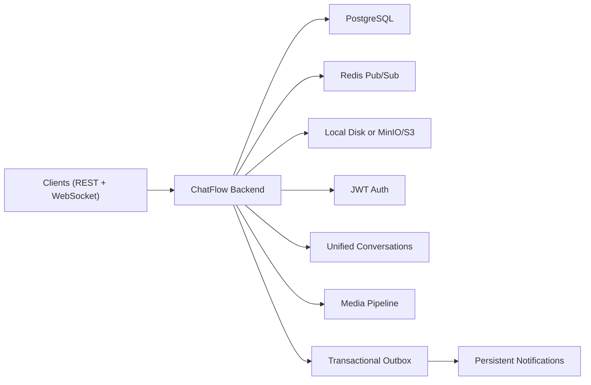
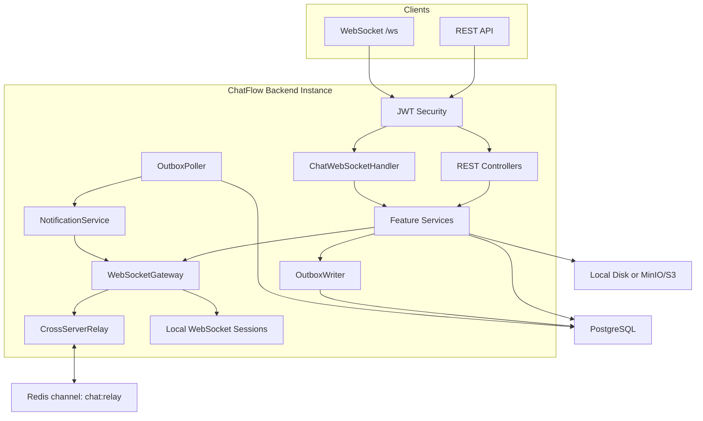
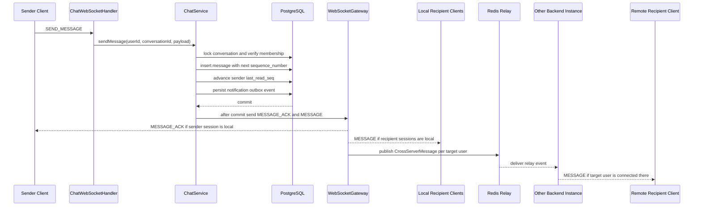
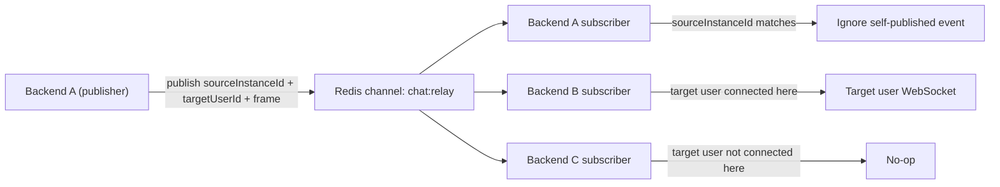
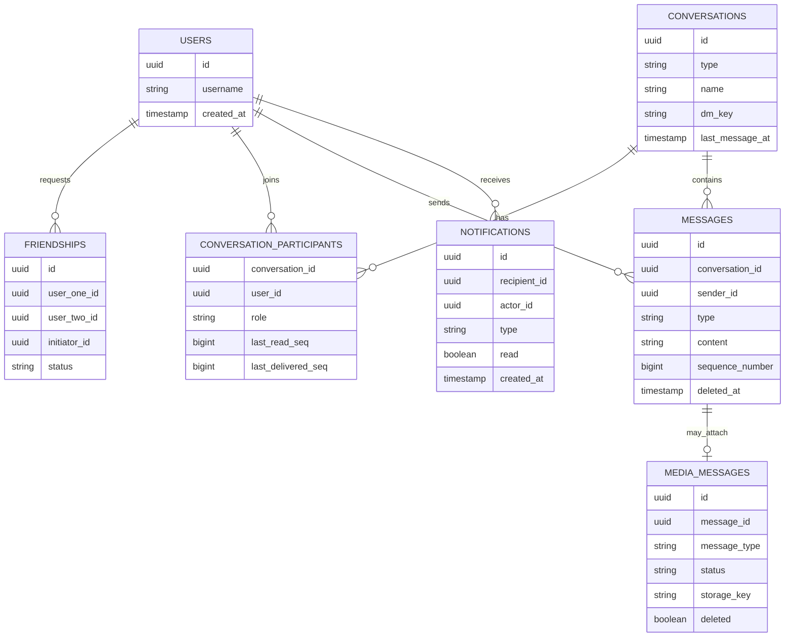

# ChatFlow Backend

<p align="center">
  
  
  
  
  
  
</p>

<p align="center">
  <b>Real-time chat backend with private messaging, group chats, media, notifications, Redis Pub/Sub, and a transactional outbox.</b>
</p>

---

## Overview

ChatFlow is a resume-grade real-time chat backend built with Spring Boot. It supports direct conversations, group conversations, friend requests, role-based group administration, media messaging, notifications, typing indicators, presence, message search, missed-message replay, and cross-instance WebSocket fanout.

The backend uses a unified conversation model: a direct chat and a group chat share the same message pipeline. The only difference is how many participants belong to the conversation.



## Resume Highlights

- Built a real-time chat platform with friend requests, private messaging, group chats, notifications, and role-based group administration.
- Implemented WebSocket messaging with Redis Pub/Sub so multiple backend instances can deliver live events to users connected on different servers.
- Added a transactional outbox for durable notification/event processing.
- Secured REST APIs and WebSocket handshakes with JWT authentication.
- Developed media messaging with validation, local or S3-compatible storage, thumbnail processing, cleanup, and access-controlled retrieval.

## Tech Stack

| Layer | Technology |
| --- | --- |
| Language | Java 21 |
| Framework | Spring Boot 4, Spring Web, Spring Security, Spring WebSocket |
| Persistence | PostgreSQL, Spring Data JPA, Flyway |
| Realtime | WebSocket, Redis Pub/Sub |
| Auth | JWT with JJWT |
| Media | Local storage or MinIO/S3, AWS SDK v2, Thumbnailator, FFmpeg |
| Observability | Spring Actuator, Micrometer, Prometheus metrics |
| Build | Maven Wrapper, Docker Compose |

## Core Features

- User registration and login with JWT.
- Friend request lifecycle: send, accept, decline, list, remove.
- Unified conversation model for both direct and group chats.
- Group roles: `OWNER`, `ADMIN`, `MEMBER`.
- Group management: create group, add/remove members, update roles, transfer ownership, delete group.
- WebSocket message sending with server ACKs and monotonic sequence numbers.
- Delivery and read receipts using participant-level watermarks.
- Offline replay of undelivered messages on reconnect.
- Typing indicators and presence events.
- Persistent notifications with unread counts and mark-read APIs.
- Media upload with MIME/type validation, thumbnails, access-controlled URLs, and cleanup retry.
- Message search across all conversations the caller belongs to.

## Architecture



### Message Flow



### Redis Pub/Sub Fanout



Redis is used for live cross-instance fanout. It is not the durable message store. PostgreSQL stores messages, and `ReplayService` uses each participant's `last_delivered_seq` to replay missed messages after reconnect.

## Data Model



The important design choice is that delivery/read state is not stored on every message. It is stored as participant cursors:

```text
Has user X read message N?
participant.last_read_seq >= message.sequence_number
```

This works for both direct chats and group chats.

## Project Structure

```text
chatflow-backend/
  src/main/java/com/chatflow/
    auth/              JWT auth, login, registration
    conversation/      Direct chats, group chats, messages, receipts, search
    friend/            Friend requests and friendship lifecycle
    media/             Uploads, validation, storage, thumbnails, access URLs
    notification/      Persistent notification feed and unread counts
    presence/          Online/offline presence
    typing/            Typing state and expiry
    infra/
      websocket/       WebSocket handler, session registry, outbound frames
      redis/           Cross-server Pub/Sub relay
      outbox/          Transactional outbox
      tx/              After-commit utilities
    config/            Security, WebSocket, scheduling, metrics, exception handling
  src/main/resources/
    db/migration/      Flyway schema
    application.yaml   Runtime configuration
```

## API Overview

| Area | Endpoint |
| --- | --- |
| Auth | `POST /api/auth/register`, `POST /api/auth/login` |
| Friends | `POST /api/friends/requests`, `GET /api/friends/requests/received`, `GET /api/friends/requests/sent`, `POST /api/friends/requests/{friendshipId}/accept`, `POST /api/friends/requests/{friendshipId}/decline`, `GET /api/friends`, `DELETE /api/friends/{userId}` |
| Conversations | `POST /api/conversations/direct`, `POST /api/conversations/group`, `GET /api/conversations`, `GET /api/conversations/{conversationId}` |
| Messages | `GET /api/conversations/{conversationId}/messages`, `GET /api/conversations/{conversationId}/messages/after` |
| Group Admin | `POST /api/conversations/{conversationId}/participants`, `DELETE /api/conversations/{conversationId}/participants/{userId}`, `PUT /api/conversations/{conversationId}/participants/{userId}/role`, `POST /api/conversations/{conversationId}/transfer-ownership`, `DELETE /api/conversations/{conversationId}` |
| Search | `GET /api/messages/search?query=...` |
| Media | `POST /api/messages/media`, `GET /api/messages/media/{id}`, `GET /api/messages/media/{id}/url`, `DELETE /api/messages/media/{id}` |
| Notifications | `GET /api/notifications`, `GET /api/notifications/unread-count`, `POST /api/notifications/{id}/read`, `POST /api/notifications/read-all`, `DELETE /api/notifications/{id}` |
| Presence | `GET /api/users/{userId}/presence`, `GET /api/conversations/{conversationId}/presence` |
| WebSocket | `/ws?token=<JWT>` |

## WebSocket Frames

Client to server:

```json
{
  "type": "SEND_MESSAGE",
  "requestId": "req-123",
  "payload": {
    "conversationId": "00000000-0000-0000-0000-000000000000",
    "clientMessageId": "client-msg-1",
    "content": "hello"
  }
}
```

Common inbound frame types:

```text
SEND_MESSAGE
MESSAGE_DELIVERED
CONVERSATION_OPEN
MARK_READ
TYPING
PING
```

Server to client:

```json
{
  "type": "MESSAGE_ACK",
  "requestId": "req-123",
  "payload": {
    "id": "message-id",
    "conversationId": "conversation-id",
    "sequenceNumber": 42,
    "content": "hello"
  }
}
```

Common outbound frame types:

```text
MESSAGE
MESSAGE_ACK
STATUS_UPDATE
SEEN_UPDATE
TYPING
PRESENCE
MEDIA_MESSAGE
MEDIA_THUMBNAIL_READY
NOTIFICATION
GROUP_MEMBER_ADDED
GROUP_MEMBER_REMOVED
GROUP_ROLE_CHANGED
GROUP_DELETED
ERROR
PONG
```

## Setup

### Prerequisites

- Java 21
- Docker and Docker Compose
- Maven Wrapper is included as `chatflow-backend/mvnw`
- Optional: FFmpeg for video thumbnails

### 1. Start infrastructure

```bash
cd chatflow-backend
docker compose up -d postgres redis
```

This starts the required local services:

| Service | URL / Port | Default Credentials |
| --- | --- | --- |
| PostgreSQL | `localhost:5432` | `chatflow / chatflow` |
| Redis | `localhost:6379` | none |

By default, the backend uses local disk storage (`./uploads`). Start MinIO only when you want to run with the `s3` profile:

```bash
docker compose up -d minio
```

Optional MinIO services:

| Service | URL / Port | Default Credentials |
| --- | --- | --- |
| MinIO API | `http://localhost:9000` | `minioadmin / minioadmin` |
| MinIO Console | `http://localhost:9001` | `minioadmin / minioadmin` |

### 2. Run the backend

```bash
./mvnw spring-boot:run
```

The app runs at:

```text
http://localhost:8080
```

Flyway runs the schema migration automatically. The app expects a fresh `chatflow` database when using the current baseline migration.

### 3. Run with MinIO/S3 storage

Create a MinIO bucket named `chatflow` from the MinIO console at `http://localhost:9001`, then run:

```bash
SPRING_PROFILES_ACTIVE=s3 ./mvnw spring-boot:run
```

Useful S3/MinIO environment variables:

```bash
S3_ENDPOINT=http://localhost:9000
S3_BUCKET=chatflow
S3_ACCESS_KEY=minioadmin
S3_SECRET_KEY=minioadmin
S3_REGION=us-east-1
```

### 4. Run tests

```bash
./mvnw test
```

The Spring context test uses the configured PostgreSQL datasource, so keep the Postgres container running before running the full test suite.

### 5. Build a jar

```bash
./mvnw clean package
java -jar target/chatflow-backend-0.0.1-SNAPSHOT.jar
```

If you only want to build the jar without running tests:

```bash
./mvnw clean package -DskipTests
```

## Configuration

Main config file:

```text
chatflow-backend/src/main/resources/application.yaml
```

Common environment variables:

| Variable | Purpose | Default |
| --- | --- | --- |
| `DB_USERNAME` | PostgreSQL username | `chatflow` |
| `DB_PASSWORD` | PostgreSQL password | `chatflow` |
| `SPRING_DATA_REDIS_HOST` | Redis host | `localhost` |
| `SPRING_DATA_REDIS_PORT` | Redis port | `6379` |
| `JWT_SECRET` | JWT signing secret | dev-only default |
| `MEDIA_UPLOAD_DIR` | Local upload directory | `./uploads` |
| `MEDIA_BASE_URL` | Local media base URL | `http://localhost:8080/media` |
| `SPRING_PROFILES_ACTIVE` | Use `s3` for MinIO/S3 storage | local storage |
| `FFMPEG_PATH` | FFmpeg binary path | `ffmpeg` |

## Notes For Reviewers

- The backend intentionally uses one `conversation` model for private and group messaging.
- Redis Pub/Sub is for live fanout across backend instances.
- PostgreSQL is the source of truth for messages, participants, notifications, and media metadata.
- The transactional outbox makes notification/event processing retryable and durable.
- Media objects are validated before storage and retrieved only after access checks.

## Resume Bullets

```latex
\resumeItem{Built a \textbf{real-time chat platform} with \textbf{friend requests}, \textbf{private messaging}, \textbf{group chats}, \textbf{notifications}, and \textbf{role-based group administration} using \textbf{Spring Boot}, \textbf{WebSocket}, and \textbf{PostgreSQL}.}

\resumeItem{Implemented \textbf{Redis Pub/Sub} for cross-instance WebSocket fanout and the \textbf{Transactional Outbox Pattern} for durable notification/event processing, improving \textbf{scalability}, \textbf{reliability}, and \textbf{fault tolerance}.}

\resumeItem{Developed \textbf{JWT-secured APIs} and \textbf{media messaging} with \textbf{MinIO/S3-compatible storage}, including \textbf{file validation}, \textbf{validated uploads}, thumbnail processing, and \textbf{access-controlled retrieval}.}
```
